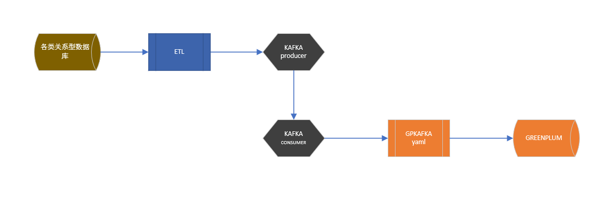
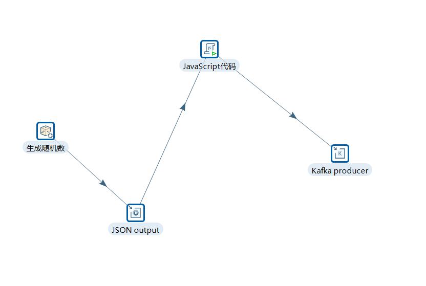
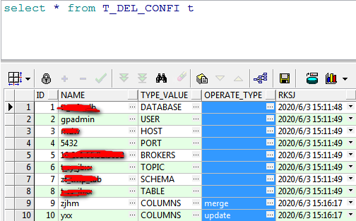

[toc]

# Gpkafka:Gpkafka 配置

**document support**

ysys

**date**

2020-06-15

**label**

greenplum,gpkafka,greenplum-5.x,greenplum-6.x,later


## step

### step one :kafka install

​	kafka 单机安装 略

### step two:greenplum install

​	greenplum 集群安装 略

### step three:project design





​	如上图所示,首先各类关系型数据库通过etl工具将数据同步kafka的producer中,我们可以利用kafka的consumer从kafka中将数据获取出来，利用gpkafka的yaml文件,将其加载到GREENPLU数据库中。


### step three:kettle solution configuration

​	目前现场很多地方使用的是kettle5.x系列,将以将kettle直接升级到kettle8.x上,原因是5.x没有自带kafka producer和kafka consumer插件，而8.x是可以自带的(网上有开源的kettle-kafka插件适配5.x)

​	方案实例



​	示例请参考下面链接[kettle project](../../mirror/kettle_kafka.xml)

### step four:gpkafka configuration

​	当json数据传递到kafka后,gp(5.x,6.x,lator)提供了gpkafka的加载数据工具,目前测试环境是gp6.3,原本gpss的环境是1.3.1,不过将gpss升级了,现在gpss环境为1.3.6

​	检查gpss版本

```shell
$ gpss -v
```

​	gpkafka 1.3.6 配置

```
DATABASE: gpdw
USER: gpadmin
HOST: master
PORT: 5432
KAFKA:
   INPUT:
     SOURCE:
       BROKERS: 192.168.1.109:7092
       TOPIC: gh11
     COLUMNS:
        - NAME: jdata
          TYPE: json
     FORMAT: json
     ERROR_LIMIT: 10
   OUTPUT:
     SCHEMA: learn
     TABLE: test01
     MAPPING:
        - NAME: id
          EXPRESSION: (jdata->'data'->>'id')::integer
        - NAME: name
          EXPRESSION: (jdata->'data'->>'name')::text
   COMMIT:
     MAX_ROW: 10000
```

​	具体参考链接:https://gpdb.docs.pivotal.io/streaming-server/1-3-6/kafka/gpkafka-yaml-v2.html

### step five:gpkafka quick 

​	我在Oracle的写了一个存储过程，过程是为了生成具体的gpkafka的对应的配置，可以适配1.3.6 中merge,和insert两种操作,操作脚本如下

```plsql
-- Create table
create table T_DEL_CONFI
();

create table T_DEL_CONFI_CLOB
()

CREATE OR REPLACE PROCEDURE SP_TEST_T_DEL_CONFI_CLOB AS
END
```

​	请参考最下面的链接[oracle create](../../mirror/greenplum_kafka_quick.txt)

而对于t_del_confi表来说，截图如下



​	

**注意一下,目前gpkafka还在继续研发中,遇到一些问题请参考具体的官网信息**


## gpload vs gpkafka

- 第一个就是现在只有gpload4.3的版本，之后gpload的版本没有获取到，如果使用服务器本身配置的话，那么就要将数据文件生成到服务器，占据服务器的空间。对于gpkafka来说，虽然是在服务器上执行，但是gpkafka的数据源头在kafka服务器上，不会说占据一份空间来说.

- 第二个对于数据加载速度来说，默认情况下gpload的效率优于gpkafka来说。

- ..

  

## link

https://gpdb.docs.pivotal.io/streaming-server/1-3-6/kafka/gpkafka-yaml-v2.html


## mirror

[kettle project](../../mirror/kettle_kafka.xml)

[oracle create](../../mirror/greenplum_kafka_quick.txt)


## error

### pq: formatter function "json_in" of type readable was not found

```
gpkafka:gpadmin:master:003850-[CRITICAL]:-exit status 2: start job fail:20200918:17:39:38.212 gpsscli:gpadmin:master:003865-[CRITICAL]:-rpc error: code = Unknown desc = InitJob: InitJob: Check executor failed: pq: formatter function "json_in" of type readable was not found
```

```
gpadmin=# create extension gpss;
CREATE EXTENSION
```

