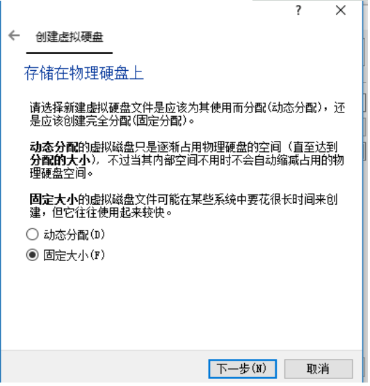
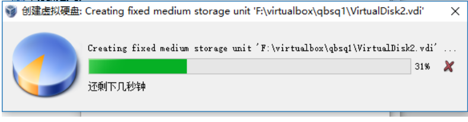

[toc]

# virtual machine add shared storage vdi

**document support**

ysys

**date**

2020-07-19

**label**

virtualbox,storage

**level**

simple

## step

​	在Oracle的架构中，需要一套共享存储来使用，在virtualbox虚拟机上可以实现对这个事情的模拟。

### 在存储上选择新建

​	因为Oracle的共享存储要求是固定大小，如果自己其他的要求的不需要固定大小，可以选择动态分配，因为动态分配初始化效率更高。

### 文件位置和大小

​	默认选择和服务器同属于一个目录，硬盘大小看实践需要，在这里使用了5g,之后选择**创建**后，就会出现下图

