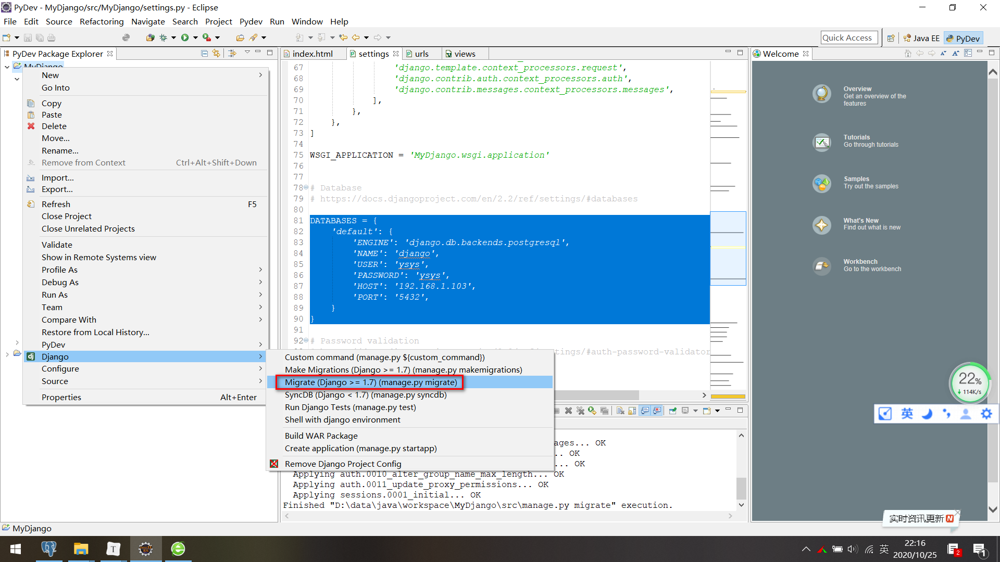

[toc]

# Django:Eclipse Django Postgresql 配置连接串

**document support**

ysys

**date**

2020-10-25

**label**

django,eclipse,postgresql,postgres,connection


## Operation

### 找到settings.py的database配置

```
DATABASES = {
    'default': {
        'ENGINE': 'django.db.backends.postgresql',
        'NAME': 'django',
        'USER': 'ysys',
        'PASSWORD': 'ysys',
        'HOST': '192.168.1.103',
        'PORT': '5432',
    }
}
```

### 在eclipse中找到执行命令



检查一下数据库上是否有表产生

```
Operations to perform:
  Apply all migrations: admin, auth, contenttypes, sessions
Running migrations:
  Applying contenttypes.0001_initial... OK
  Applying auth.0001_initial... OK
  Applying admin.0001_initial... OK
  Applying admin.0002_logentry_remove_auto_add... OK
  Applying admin.0003_logentry_add_action_flag_choices... OK
  Applying contenttypes.0002_remove_content_type_name... OK
  Applying auth.0002_alter_permission_name_max_length... OK
  Applying auth.0003_alter_user_email_max_length... OK
  Applying auth.0004_alter_user_username_opts... OK
  Applying auth.0005_alter_user_last_login_null... OK
  Applying auth.0006_require_contenttypes_0002... OK
  Applying auth.0007_alter_validators_add_error_messages... OK
  Applying auth.0008_alter_user_username_max_length... OK
  Applying auth.0009_alter_user_last_name_max_length... OK
  Applying auth.0010_alter_group_name_max_length... OK
  Applying auth.0011_update_proxy_permissions... OK
  Applying sessions.0001_initial... OK
Finished "D:\data\java\workspace\MyDjango\src\manage.py migrate" execution.
```

