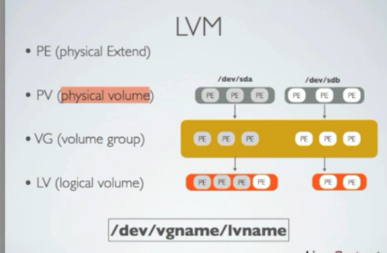
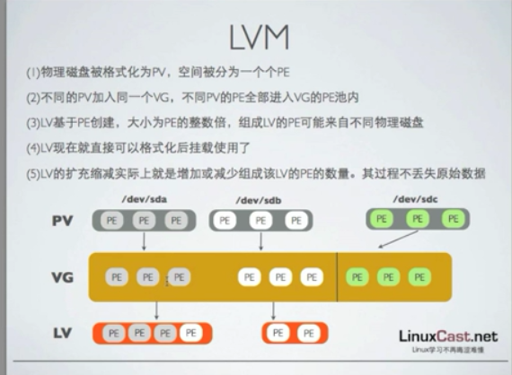

[TOC]

# LINUX 逻辑卷 CREATE EXTEND

**document support**

ysys

**date**

2020-01-01

**label**

linux,vgs,pvs,lvs,extent


## Background


## Knewledge


​	lvs：逻辑卷是区别于普通的磁盘分区直接挂载到系统来使用的，优势就是不关闭就可以添加磁盘空间来弥补空间不足的情况 

​	在2017年就遇到一个情况，LC给了一个虚拟机，划了200g到了根路径，还剩余300g没有划出来，当时这个系统是作为数据库使用的，随着时间增加，空间不够用时，发现根路径是磁盘分区后格式化挂载的，没有做逻辑卷这种方式，就要重新安装系统，重新导出数据，重新安装数据库，这个工作量其实还是不小的。所以在给服务器尤其是存储数据之类的数据库服务器，尤其是要查看当前环境是支持动态添加硬盘。 







## CREATE

```
将添加的硬盘变为物理卷
pvcreate /dev/sda3

将物理卷变为卷组
vgcreate  vgname /dev/sdb /dev/sdc

创建逻辑卷
lvcreate -n mylv -L 2G vgname

为逻辑卷创建文件系统 
mkfs.ext4 /dev/vgname/mylv

将逻辑卷挂载到某一路径下
mount /dev/vgname/mylv /mnt
```

## DISPLAY

```
pvs

vgs

lvs

```


## DEL

```
lvremove

vgremove

pvremove

```


## EXTEND

1. 首先检查卷组是否还有空间，如果有空间，可以直接给逻辑卷添加新的空间大小

   ```
   # vgs
   
   # lvextend -L +80G /dev/vg_qbname/lv_root
   
   # resize2fs /dev/vg_qbname/lv_root
   ```

2. 如果卷组空间不够的话，要么检查当前磁盘是否还有空间，要么添加新的磁盘

   ```
   # fdisk -l
   
   # pvcreate /dev/sdc1
   
   # vgextend vg_qbname /dev/sda3
   
   # lvextend -L +80G /dev/vg_qbname/lv_root
   ext4
   # resize2fs /dev/vg_qbname/lv_root
   
   ```


```
xfs 报错
# resize2fs /dev/cl/root 
resize2fs 1.42.9 (28-Dec-2013)
resize2fs: Bad magic number in super-block while trying to open /dev/cl/root
Couldn't find valid filesystem superblock.

# xfs_growfs /dev/cl/root 
meta-data=/dev/mapper/cl-root    isize=512    agcount=4, agsize=641792 blks
         =                       sectsz=512   attr=2, projid32bit=1
         =                       crc=1        finobt=0 spinodes=0
data     =                       bsize=4096   blocks=2567168, imaxpct=25
         =                       sunit=0      swidth=0 blks
naming   =version 2              bsize=4096   ascii-ci=0 ftype=1
log      =internal               bsize=4096   blocks=2560, version=2
         =                       sectsz=512   sunit=0 blks, lazy-count=1
realtime =none                   extsz=4096   blocks=0, rtextents=0
data blocks changed from 2567168 to 5188608
```


## 缩小逻辑卷

​	逻辑卷缩小慎之又慎

卸载逻辑卷

umount

缩小文件系统

resize2fs /dev/linuxcast/mylv 1G

缩小LV

lvreduce -L -1G /dev/linuxcast/mylv 

lvdisplay

缩小卷组

vgreduce vgname /dev/sdb1

移除物理卷

pvremove /dev/sdb1


**其实还是可以将逻辑卷缩小，剩余新的空间来释放分区或者是增加卷组的大小来提供给替他的使用，不过建议不要这样做，可能会导致损害数据。**


**大部分情况下resize2fs就可以了执行文件更新，但对于xfs文件系统就是会报错，需要使用命令 xfs_growfs /dev/vg_qbname/lv_root才可以**

