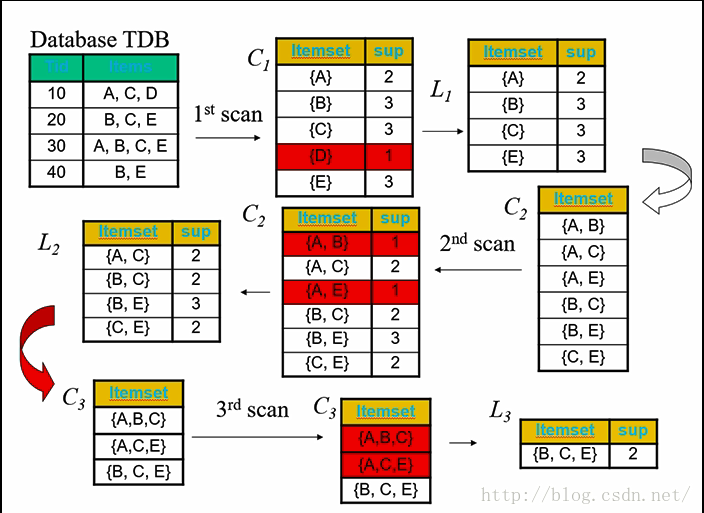

[toc]

# 机器算法 Apriori算法

**document support**

ysys

**date**

2020-08-17

**label**

apriori,摘抄

## 介绍

​	Aprior algorithm是关联规则里一项基本算法

​	目的是在一个数据集中找出项与项之间的关系

### 基本概念

​	对于A->B

- 支持度P(A∩B)
- 置信度P(AB)/P(A)

​	例子[支持度10%,置信度40%]

支持度10%:代表AB同时发生10%

置信度40%:购买A的人有40%的可能性购买B

### 算法描述

​	首先找出频繁“1项集“的集合，该集合记作L1，L1用于找频繁”2项集“L2,...,如此下去直到不能找到K项集

### 算法示例

## link

https://blog.csdn.net/u012102306/article/details/51636452

