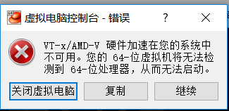

[TOC]

# virtualbox not open machine with vt-x

**document support**

ysys

**date**

2018-11-06

**label**

virtualbox not open machine,vt-x,amd-v

## 背景

​	几天前我的电脑无法开机，送到维修的地方去了，后来拿回来是和我说是因为静电问题，将我的电脑重新打开BIOS后放掉静电，现在无法打开虚拟机，出现报错

## 解决方案

​	当前我的电脑是惠普，让电脑处于重启状态并一直不停按着`F10`按键，说明他们确实对我的BIOS主板进行了操作，可是没有将我的设置给我保存，可能对主板进行初始化了，重新将虚拟化打开，就可以使用了。

## 链接地址

http://www.xitongcheng.com/jiaocheng/xtazjc_article_39303.html