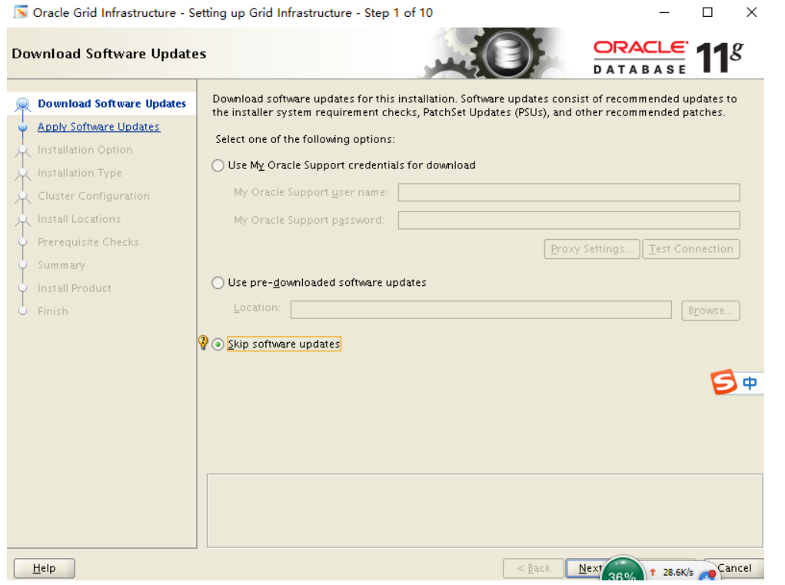
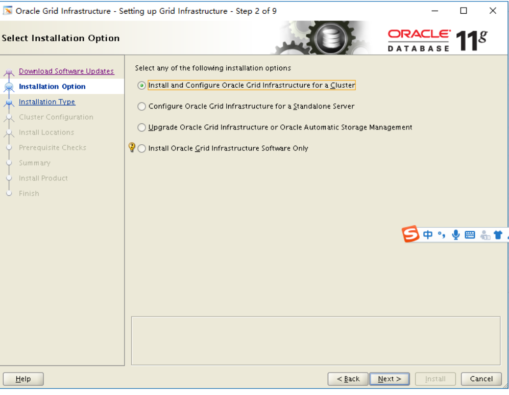
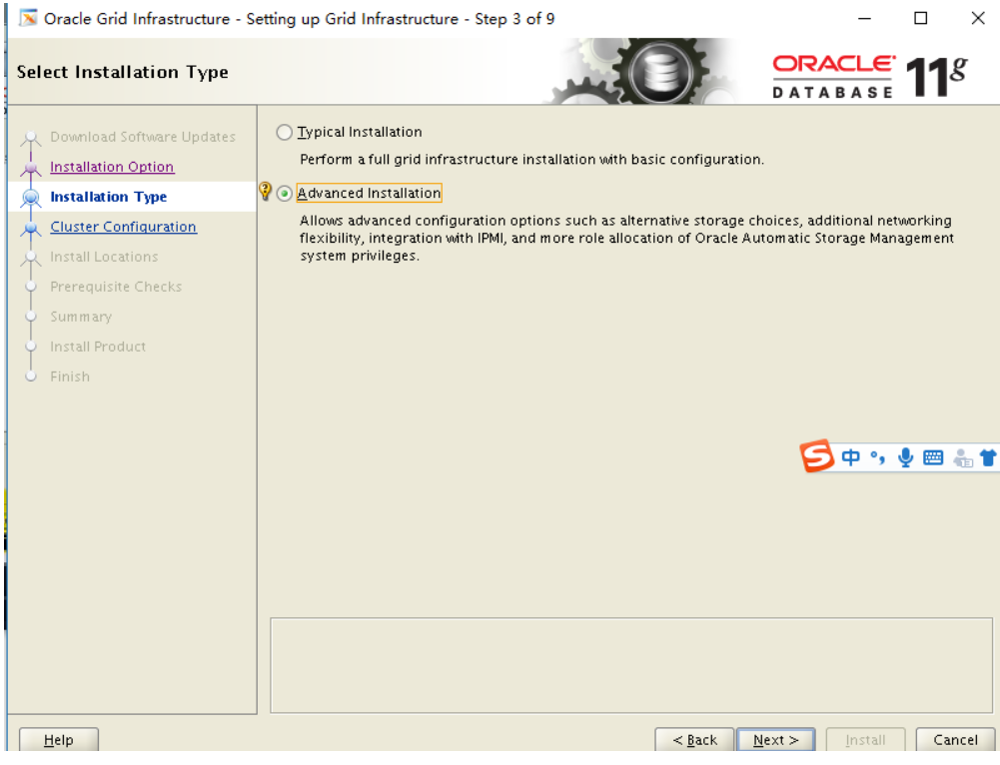
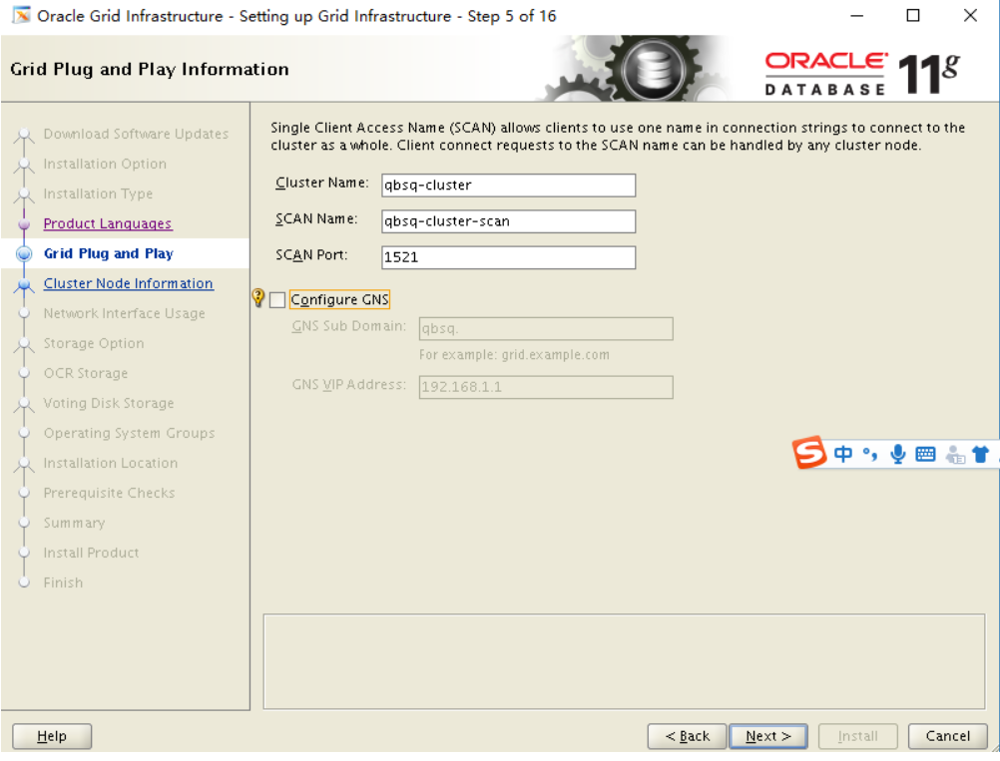
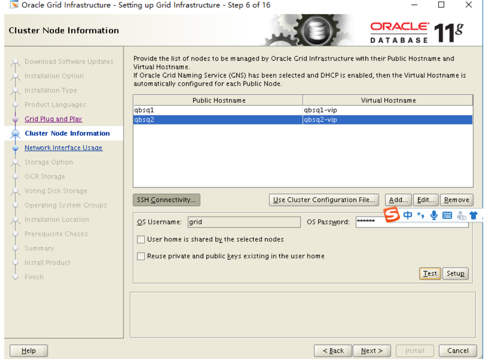
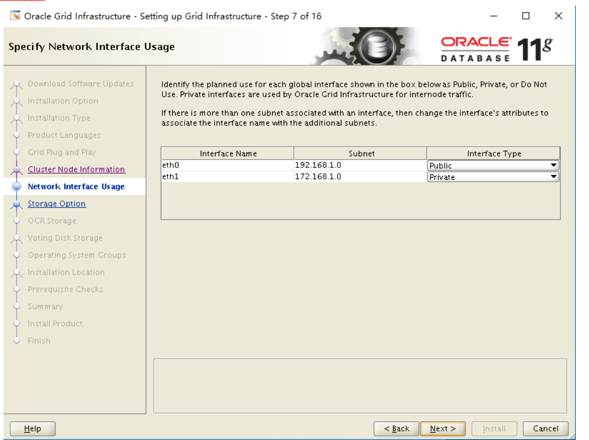
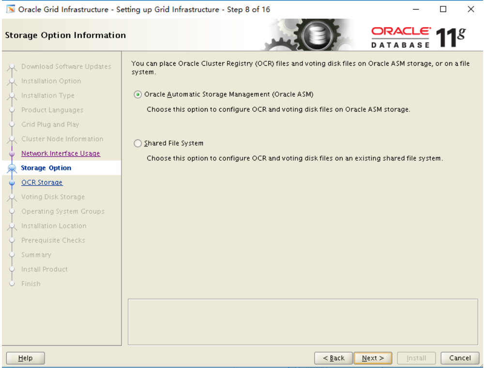
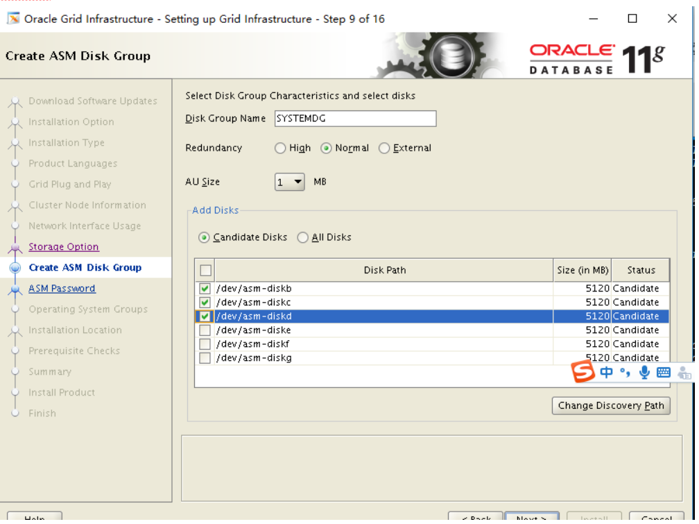
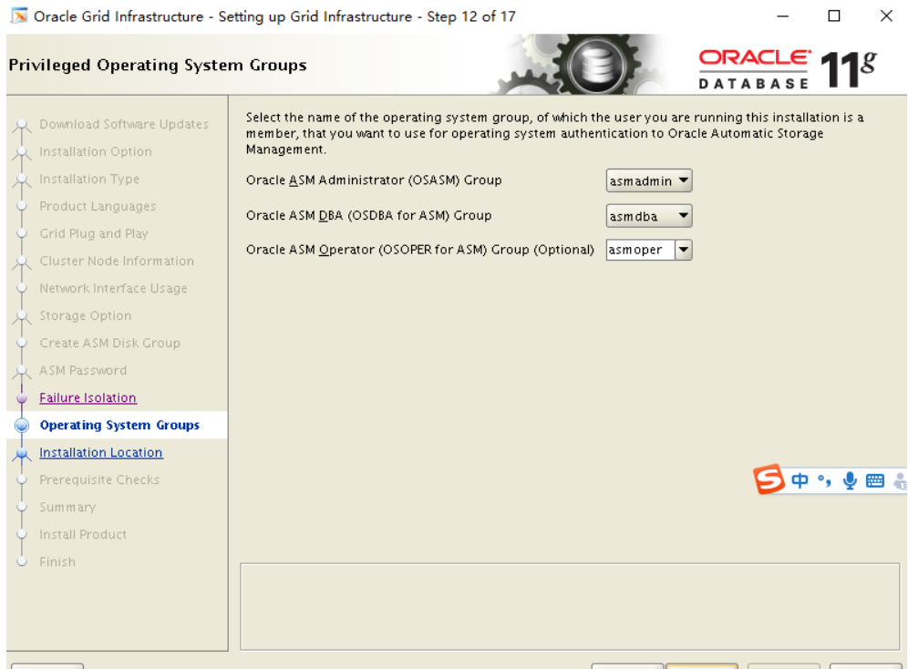

[toc]

# Oracle:虚拟机部署ORACLERAC集群

**document support**

ysys

**date**

2020-07-10

**label**

oracle,oracle rac,11.2,11.2.0.4,install,virtualbox,centos6.5

**level**

hard


## background

​	最近一段时间,一些项目需要数据迁移,有一种方法是rman duplicate,这样需要两个Oracle集群。为此，特意重新搭建一套虚拟机集群，重新熟悉一些操作步骤。


## enviroment

### configuration

​	

| 主机名 | 内存 | 硬盘 | CPU  | ip 1(public) | ip 2(private) |
| ------ | ---- | ---- | ---- | ------------ | ------------- |
| ghdb1  | 1.5G | 30G  | 1    | 192.168.1.31 | 172.168.1.31  |
| ghdb2  | 1.5G | 30G  | 1    | 192.168.1.32 | 172.168.1.32  |

### ipaddress


| ip           | 映射          |
| ------------ | ------------- |
| 192.168.1.31 | ghdb1         |
| 192.168.1.32 | ghdb2         |
| 192.168.1.33 | ghdb1-vip     |
| 192.168.1.34 | ghdb2-vip     |
| 172.168.1.31 | ghdb1-private |
| 172.168.1.32 | ghdb2-private |
| 192.168.1.35 | scan-rac      |


## step

### server installation

​	服务器安装,或者服务器复制的流程略过<>[]

### basic operation

关闭FIREWALL和Disable SElinux

```
vim /etc/selinux/config ==>SELINUX=disabled
service iptables stop
chkconfig iptables off
```

修改/etc/hosts

```
192.168.1.31   ghdb1 ghdb1.oracle.com
192.168.1.33   ghdb1-vip  
192.168.1.32   ghdb2 ghdb2.oracle.com
192.168.1.34   ghdb2-vip
192.168.1.35   ghdb-cluster ghdb-scan-rac 
172.168.1.31   ghdb1-priv
172.168.1.32   ghdb2-priv
```

创建用户和组

```
groupadd -g 5000 asmadmin
groupadd -g 5001 asmdba
groupadd -g 5002 asmoper
groupadd -g 6000 oinstall
groupadd -g 6001 dba
groupadd -g 6002 oper 


useradd -g oinstall -G asmadmin,asmdba,asmoper grid  
useradd -g oinstall -G dba,asmdba              oracle

passwd oracle
passwd grid

mkdir /s01
mkdir /g01
chown oracle:oinstall /s01
chown grid:oinstall   /g01
```

配置yum本地源,执行依赖包rpm安装

```
mount /dev/sr0 /media
cd /etc/yum.repos.d/
rm -rf CentOS*
```

```
# vim ysys.repo
[ysys]
name=ysys
baseurl=file:///media
gpgcheck=0
enabled=1
```

```
yum clean all
yum update
```

```
yum -y install elfutils-libelf-develbinutils compat-libcap1 compat-libstdc++*.i686 compat-libstdc++-33 gcc gcc-c++  glibc  glibc-devel ksh libaio*.i686 libaio libaio-devel-*.i686 libaio-devel libgcc*.i686 libgcc libstdc++*.i686 libstdc++ libstdc++-devel*.i686 libstdc++-devel libXi*.i686 libXi libXtst-*.i686 libXtst make sysstat unixODBC unixODBC-devel  elfutils-libelf-devel-0.* xterm
```

在/etc/sysctl.conf的后面添加下列几行

```
fs.aio-max-nr = 1048576
fs.file-max = 6815744
kernel.shmall = 2097152
kernel.shmmax = 1054504960
kernel.shmmni = 4096
kernel.sem = 250 32000 100 128
net.ipv4.ip_local_port_range = 9000 65500
net.core.rmem_default=262144
net.core.rmem_max=4194304
net.core.wmem_default=262144
```

```
# /sbin/sysctl -p
```

在/etc/security/limits.conf中添加下列几行

```
oracle      soft    nproc   2047
oracle      hard    nproc   16384
oracle      soft    nofile  1024
oracle      hard    nofile  65536
grid   		soft   	nofile    1024
grid   		hard   nofile    65536
grid   		soft   nproc    2047
grid   		hard   nproc    16384
```

在/etc/pam.d/login添加几行

```
session    required     pam_limits.so
```

### virtual storage add

[virtual machine add shared storage vdi](20200701_19.md)

### upload software

​	将文件上传到节点一上

p13390677_112040_Linux-x86-64_1of7.zip

p13390677_112040_Linux-x86-64_2of7.zip

p13390677_112040_Linux-x86-64_3of7grid.zip


## grid install

​	请注意下面用的截图是之前部署时使用的，与现在的环境不太一致。

```
# for i in b c d e f g ;
>         do
>         echo "KERNEL==\"sd*\", BUS==\"scsi\", PROGRAM==\"/sbin/scsi_id --whitelisted --replace-whitespace --device=/dev/\$name\", RESULT==\"`/sbin/scsi_id --whitelisted --replace-whitespace --device=/dev/sd$i`\", NAME=\"asm-disk$i\", OWNER=\"grid\", GROUP=\"asmadmin\", MODE=\"0660\""      >> /etc/udev/rules.d/99-oracle-asmdevices.rules>         done
#  /sbin/start_udev
```


​	将zip文件提取到/g01/grid_11204

```
#unzip p13390677_112040_Linux-x86-64_3of7grid.zip -d /g01/grid_11204
```

​	使用xstart软件登录到节点一的grid图形化用户下

```
#./runInstall
```

​    3】图像如下

​            选择跳过应用更新



​                    选择"install and configure oracle grid in.. for a cluster"



​            选择"advanced installationr"



​                取消"configure GNS",查看/etc/hosts 中scan的名称           



​                    添加“qbsq2”的信息并且选择“SSH Connectivity” 输入grid用户密码选择“setup”

​                    后，选择“test”



​                    检查网关地址



​                    选择“oracle automatic storage management(oracle asm)”



​                    建议如下，后期如果开启归档的话，把归档路径放到SYSTEMDG下，如果

​                    使用rman备份，默认路径也会放到SYSTEMDG下，SYTEMDG空间可以占到

​                    共享存储的1/6左右，其他的变为DATADG

​                    

​                    选择“change discovery path”，在“**设置虚拟存储并初始化**”时的路径为

​                    /dev/asm*



​                    选择"USE name passwords for these accouts"


​                    检查asm operator的权限是否是asmoper



​                        路径做好写成下面的这样的话，配置环境变量就不需要更改了(在这里请参考自己之前的规划)


​                    


上图中有个“fix & check agin”点击后出现


分别在节点一，节点二使用root执行改脚本，点击OK,会重新检查一遍

添加package的包

点击ignore all

注意：如果出现特别多的报错，那么就很有可能安装不成功


​       现在节点一上执行两个root脚本，后在节点二上执行两个root脚本，执行完后，点击

​    ok按钮


​    


## oracle software install


## link

http://note.youdao.com/s/OoJZnQcf