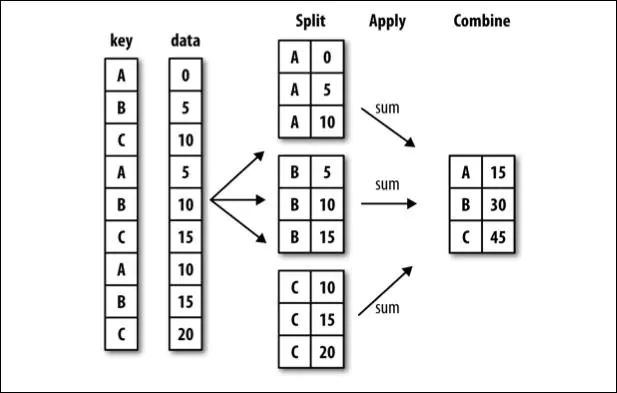
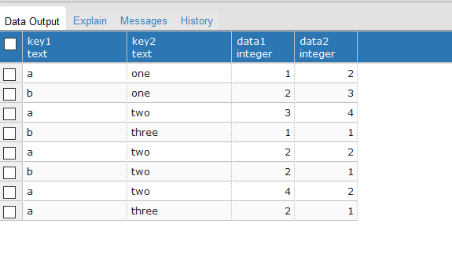
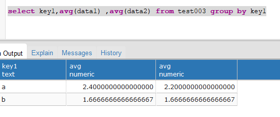
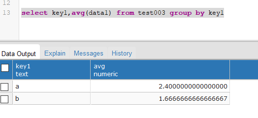

[toc]

# Python:Pandas分组与聚合

**document support**

ysys

**date**

2020-09-25

**label**

python,group by,statistics,pandas


## Background


## Summary


## Question


## Knowledge

​	为了更好的和数据库的group by相对应，从数据库获取数据，分别通过pandas和数据库脚本同时获取对应数据,以此来加深理解


### 分组 (groupby)

- 对数据集进行分组，然后对每组进行统计分析
- SQL能够对数据进行过滤，分组聚合
- pandas能利用groupby进行更加复杂的分组运算
- 分组运算过程：split->apply->combine
  - 拆分：进行分组的根据
  - 应用：每个分组运行的计算规则
  - 合并：把每个分组的计算结果合并起来



### 数据库测试数据

```plsql
create table test003(key1 text,key2 text,data1 int4,data2 int4);
insert into test003 values('a','one',1,2);
insert into test003 values('b','one',2,3);
insert into test003 values('a','two',3,4);
insert into test003 values('b','three',1,1);
insert into test003 values('a','two',2,2);
insert into test003 values('b','two',2,1);
insert into test003 values('a','two',4,2);
insert into test003 values('a','three',2,1);

select * from test003;
```



### 构建数据框


```python
import pandas as pd
import psycopg2
# 为了更好的学习并且和数据库联系起来，现在将一些数据直接存储到数据库中，看看pandas的结果
# 和普通sql结果之间的区别

conn=psycopg2.connect(database="postgres",user="ysys",password="ysys",host="192.168.1.103",port="5432")
df_obj = pd.read_sql('select * from test003',conn)
print(df_obj)
print(type(df_obj))
```

```
  key1   key2  data1  data2
0    a    one      1      2
1    b    one      2      3
2    a    two      3      4
3    b  three      1      1
4    a    two      2      2
5    b    two      2      1
6    a    two      4      2
7    a  three      2      1
<class 'pandas.core.frame.DataFrame'>
```

​	可以看出df_obj确实是数据框对象了


### 一、GroupBy 对象:DataFrameGroupBy,SerialGroupBy


#### 1.分组操作

​	groupby()进行分组,GroupBy对象没有进行实际运算，只是返回包含分组的中间数据

​	按照列名分组:obj.groupby('label')

```python
# dataframe 根据key1进行分组
print(type(df_obj.groupby('key1')))

# dataframe 的data1列根据key1 进行分组
print(type(df_obj['data1'].groupby(df_obj['key1'])))
```

```python
<class 'pandas.core.groupby.generic.DataFrameGroupBy'>
<class 'pandas.core.groupby.generic.SeriesGroupBy'>
```


#### 2.分组计算

​	对GroupBy对象进行分组预算、多重分组运算，如mean()

​	非数值数据不进行分组运算

```python
grouped1 = df_obj.groupby('key1')
print(grouped1.mean())
grouped2 = df_obj['data1'].groupby(df_obj['key1'])
print(grouped2.mean())
```

```python
         data1     data2
key1
a     2.400000  2.200000
b     1.666667  1.666667
key1
a    2.400000
b    1.666667
Name: data1, dtype: float64
```


```
select key1,avg(data1) ,avg(data2) from test003 group by key1
```

对等

```
grouped1 = df_obj.groupby('key1')
print(grouped1.mean())
```




```
select key1,avg(data1) from test003 group by key1
```

对等

```
grouped2 = df_obj['data1'].groupby(df_obj['key1'])
print(grouped2.mean())
```



​	size()返回每个分组的元素个数

```python
# size
print(grouped1.size())
print(grouped2.size())
```

```python
key1
a    5
b    3
dtype: int64
key1
a    5
b    3
Name: data1, dtype: int64
```


#### 3.按照自定义的key分组

​	obj.groupby(self_def_key)

​	自定义的key可列为列表或多层列表

​	obj.groupby(['label1',;label2']) 多层dataframe

```
# 按自定义key分组,列表
self_def_key =[0,1,2,3,4,5,6,7]
print(df_obj.groupby(self_def_key).size())

# 按自定义key分组，多层列表
print(df_obj.groupby([df_obj['key1'],df_obj['key2']]).size())

# 按多个列多层分组
grouped2 = df_obj.groupby(['key1','key2'])
print(grouped2.size())

# 多层分组按key的顺序进行
grouped3 = df_obj.groupby(['key1','key2'])
print(grouped3.mean())

# unstack可以将多层索引的结果转换成单层的dataframe
print(grouped3.mean().unstack())
```

```
0    1
1    1
2    1
3    1
4    1
5    1
6    1
7    1
dtype: int64
key1  key2
a     one      1
      three    1
      two      3
b     one      1
      three    1
      two      1
dtype: int64
key1  key2
a     one      1
      three    1
      two      3
b     one      1
      three    1
      two      1
dtype: int64
            data1     data2
key1 key2
a    one      1.0  2.000000
     three    2.0  1.000000
     two      3.0  2.666667
b    one      2.0  3.000000
     three    1.0  1.000000
     two      2.0  1.000000
     data1            data2
key2   one three  two   one three       two
key1
a      1.0   2.0  3.0   2.0   1.0  2.666667
b      2.0   1.0  2.0   3.0   1.0  1.000000
```


```
# 多层分组按key的顺序进行
grouped3 = df_obj.groupby(['key1','key2'])
print(grouped3.mean())

# 和sql语句对等
select key1,key2,avg(data1) from test003 group by key1,key2

```


### 二、GroupBy 对象支持迭代操作

​	每次迭代返回一个元组(group_name,group_date)

​	可用于分组数据的具体运算

#### 1.单层分组

​	示例代码

```
# 单层分组,根据key1
for group_name,group_data in grouped1:
	print(group_name)
	print(group_data)
```

```
a
  key1   key2  data1  data2
0    a    one      1      2
2    a    two      3      4
4    a    two      2      2
6    a    two      4      2
7    a  three      2      1
b
  key1   key2  data1  data2
1    b    one      2      3
3    b  three      1      1
5    b    two      2      1
```


#### 2.多层分组

​	示例代码

```
# 多层分组,根据key1,key2

for group_name,group_data in grouped2:
	print(group_name)
	print(group_data)
```

```
('a', 'one')
  key1 key2  data1  data2
0    a  one      1      2
('a', 'three')
  key1   key2  data1  data2
7    a  three      2      1
('a', 'two')
  key1 key2  data1  data2
2    a  two      3      4
4    a  two      2      2
6    a  two      4      2
('b', 'one')
  key1 key2  data1  data2
1    b  one      2      3
('b', 'three')
  key1   key2  data1  data2
3    b  three      1      1
('b', 'two')
  key1 key2  data1  data2
5    b  two      2      1
```

### 三、GroupBy对象可以转换为列表或字典

​	示例代码

```
# GroupBy对象转换list
print(list(grouped1))

# GroupBy对象转换dict
print(dict(list(grouped1)))
```

```
[('a',   key1   key2  data1  data2
0    a    one      1      2
2    a    two      3      4
4    a    two      2      2
6    a    two      4      2
7    a  three      2      1), ('b',   key1   key2  data1  data2
1    b    one      2      3
3    b  three      1      1
5    b    two      2      1)]
{'a':   key1   key2  data1  data2
0    a    one      1      2
2    a    two      3      4
4    a    two      2      2
6    a    two      4      2
7    a  three      2      1, 'b':   key1   key2  data1  data2
1    b    one      2      3
3    b  three      1      1
5    b    two      2      1}
```

#### 1.按列分组，按数据类型分组

​	示例代码

```
# 按列分组
print(df_obj.dtypes)

# 按数据类型分组
print(df_obj.groupby(df_obj.dtypes,axis=1).size())
print(df_obj.groupby(df_obj.dtypes,axis=1).sum())

```

```
key1     object
key2     object
data1     int64
data2     int64
dtype: object
int64     2
object    2
dtype: int64
   int64  object
0      3    aone
1      5    bone
2      7    atwo
3      2  bthree
4      4    atwo
5      3    btwo
6      6    atwo
7      3  athree
```

#### 2.其他分组方法

​	示例代码

```
import numpy as np

df_obj2 = pd.DataFrame(np.random.randint(1, 10, (5,5)),
                       columns=['a', 'b', 'c', 'd', 'e'],
                       index=['A', 'B', 'C', 'D', 'E'])
df_obj2.iloc[1, 1:4] = np.NaN
print(df_obj2)
```

```
   a    b    c    d  e
A  7  2.0  7.0  4.0  6
B  4  NaN  NaN  NaN  7
C  9  5.0  8.0  2.0  1
D  5  7.0  3.0  7.0  3
E  2  3.0  6.0  2.0  9
```


#### 3.通过字段分组


```
# 通过字典分组
mapping_dict = {'a':'Python', 'b':'Python', 'c':'Java', 'd':'C', 'e':'Java'}
print(df_obj2.groupby(mapping_dict, axis=1).size())
print(df_obj2.groupby(mapping_dict, axis=1).count()) # 非NaN的个数
print(df_obj2.groupby(mapping_dict, axis=1).sum())
```


```
C         1
Java      2
Python    2
dtype: int64
   C  Java  Python
A  1     2       2
B  0     1       1
C  1     2       2
D  1     2       2
E  1     2       2
     C  Java  Python
A  1.0  12.0    10.0
B  0.0   1.0     9.0
C  7.0  13.0    10.0
D  1.0  10.0    15.0
E  9.0   9.0     9.0
```

#### 4.通过函数分组，函数传入的参数为行索引或列索引

示例代码：


```python
# 通过函数分组
df_obj3 = pd.DataFrame(np.random.randint(1, 10, (5,5)),
                       columns=['a', 'b', 'c', 'd', 'e'],
                       index=['AA', 'BBB', 'CC', 'D', 'EE'])
#df_obj3

def group_key(idx):
    """
        idx 为列索引或行索引
    """
    #return idx
    return len(idx)

print(df_obj3.groupby(group_key).size())

# 以上自定义函数等价于
#df_obj3.groupby(len).size()
```

运行结果：


```go
1    1
2    3
3    1
dtype: int64
```

#### 5. 通过索引级别分组

示例代码：


```bash
# 通过索引级别分组
columns = pd.MultiIndex.from_arrays([['Python', 'Java', 'Python', 'Java', 'Python'],
                                     ['A', 'A', 'B', 'C', 'B']], names=['language', 'index'])
df_obj4 = pd.DataFrame(np.random.randint(1, 10, (5, 5)), columns=columns)
print(df_obj4)

# 根据language进行分组
print(df_obj4.groupby(level='language', axis=1).sum())
# 根据index进行分组
print(df_obj4.groupby(level='index', axis=1).sum())
```

运行结果：


```undefined
language Python Java Python Java Python
index         A    A      B    C      B
0             2    7      8    4      3
1             5    2      6    1      2
2             6    4      4    5      2
3             4    7      4    3      1
4             7    4      3    4      8

language  Java  Python
0           11      13
1            3      13
2            9      12
3           10       9
4            8      18

index   A   B  C
0       9  11  4
1       7   8  1
2      10   6  5
3      11   5  3
4      11  11  4
```

### 四、聚合 (aggregation)

- 数组产生标量的过程，如mean()、count()等
- 常用于对分组后的数据进行计算

示例代码：


```bash
dict_obj = {'key1' : ['a', 'b', 'a', 'b', 
                      'a', 'b', 'a', 'a'],
            'key2' : ['one', 'one', 'two', 'three',
                      'two', 'two', 'one', 'three'],
            'data1': np.random.randint(1,10, 8),
            'data2': np.random.randint(1,10, 8)}
df_obj5 = pd.DataFrame(dict_obj)
print(df_obj5)
```

运行结果：


```undefined
   data1  data2 key1   key2
0      3      7    a    one
1      1      5    b    one
2      7      4    a    two
3      2      4    b  three
4      6      4    a    two
5      9      9    b    two
6      3      5    a    one
7      8      4    a  three
```

#### 1. 内置的聚合函数

> ```
> sum(), mean(), max(), min(), count(), size(), describe()
> ```

示例代码：


```bash
print(df_obj5.groupby('key1').sum())
print(df_obj5.groupby('key1').max())
print(df_obj5.groupby('key1').min())
print(df_obj5.groupby('key1').mean())
print(df_obj5.groupby('key1').size())
print(df_obj5.groupby('key1').count())
print(df_obj5.groupby('key1').describe())
```

运行结果：


```css
      data1  data2
key1              
a        27     24
b        12     18

      data1  data2 key2
key1                   
a         8      7  two
b         9      9  two

      data1  data2 key2
key1                   
a         3      4  one
b         1      4  one

      data1  data2
key1              
a       5.4    4.8
b       4.0    6.0

key1
a    5
b    3
dtype: int64

      data1  data2  key2
key1                    
a         5      5     5
b         3      3     3

               data1     data2
key1                          
a    count  5.000000  5.000000
     mean   5.400000  4.800000
     std    2.302173  1.303840
     min    3.000000  4.000000
     25%    3.000000  4.000000
     50%    6.000000  4.000000
     75%    7.000000  5.000000
     max    8.000000  7.000000
b    count  3.000000  3.000000
     mean   4.000000  6.000000
     std    4.358899  2.645751
     min    1.000000  4.000000
     25%    1.500000  4.500000
     50%    2.000000  5.000000
     75%    5.500000  7.000000
     max    9.000000  9.000000
```

#### 2. 可自定义函数，传入agg方法中

> ```
> grouped.agg(func)
> func的参数为groupby索引对应的记录
> ```

示例代码：


```python
# 自定义聚合函数
def peak_range(df):
    """
        返回数值范围
    """
    #print type(df) #参数为索引所对应的记录
    return df.max() - df.min()

print(df_obj5.groupby('key1').agg(peak_range))
print(df_obj.groupby('key1').agg(lambda df : df.max() - df.min()))
```

运行结果：


```css
      data1  data2
key1              
a         5      3
b         8      5

         data1     data2
key1                    
a     2.528067  1.594711
b     0.787527  0.386341
In [25]:
```

#### 3. 应用多个聚合函数

同时应用多个函数进行聚合操作，使用函数列表

示例代码：


```bash
# 应用多个聚合函数

# 同时应用多个聚合函数
print(df_obj.groupby('key1').agg(['mean', 'std', 'count', peak_range])) # 默认列名为函数名

print(df_obj.groupby('key1').agg(['mean', 'std', 'count', ('range', peak_range)])) # 通过元组提供新的列名
```

运行结果：


```css
         data1                                data2                           
          mean       std count peak_range      mean       std count peak_range
key1                                                                          
a     0.437389  1.174151     5   2.528067 -0.230101  0.686488     5   1.594711
b     0.014657  0.440878     3   0.787527  0.802114  0.196850     3   0.386341

         data1                               data2                          
          mean       std count     range      mean       std count     range
key1                                                                        
a     0.437389  1.174151     5  2.528067 -0.230101  0.686488     5  1.594711
b     0.014657  0.440878     3  0.787527  0.802114  0.196850     3  0.386341
```

#### 4. 对不同的列分别作用不同的聚合函数，使用dict

示例代码：


```bash
# 每列作用不同的聚合函数
dict_mapping = {'data1':'mean',
                'data2':'sum'}
print(df_obj.groupby('key1').agg(dict_mapping))

dict_mapping = {'data1':['mean','max'],
                'data2':'sum'}
print(df_obj.groupby('key1').agg(dict_mapping))
```

运行结果：


```css
         data1     data2
key1                    
a     0.437389 -1.150505
b     0.014657  2.406341

         data1               data2
          mean       max       sum
key1                              
a     0.437389  1.508838 -1.150505
b     0.014657  0.522911  2.406341
```

#### 5. 常用的内置聚合函数

> 
>
> # 数据的分组运算

示例代码：


```python
import pandas as pd
import numpy as np

dict_obj = {'key1' : ['a', 'b', 'a', 'b', 
                      'a', 'b', 'a', 'a'],
            'key2' : ['one', 'one', 'two', 'three',
                      'two', 'two', 'one', 'three'],
            'data1': np.random.randint(1, 10, 8),
            'data2': np.random.randint(1, 10, 8)}
df_obj = pd.DataFrame(dict_obj)
print(df_obj)

# 按key1分组后，计算data1，data2的统计信息并附加到原始表格中，并添加表头前缀
k1_sum = df_obj.groupby('key1').sum().add_prefix('sum_')
print(k1_sum)
```

运行结果：


```undefined
   data1  data2 key1   key2
0      5      1    a    one
1      7      8    b    one
2      1      9    a    two
3      2      6    b  three
4      9      8    a    two
5      8      3    b    two
6      3      5    a    one
7      8      3    a  three

      sum_data1  sum_data2
key1                      
a            26         26
b            17         17
```

> ```
> 聚合运算后会改变原始数据的形状，
> 如何保持原始数据的形状?
> ```

#### 6. merge

> ```
> 使用merge的外连接，比较复杂
> ```

示例代码：


```php
# 方法1，使用merge
k1_sum_merge = pd.merge(df_obj, k1_sum, left_on='key1', right_index=True)
print(k1_sum_merge)
```

运行结果：


```undefined
   data1  data2 key1   key2  sum_data1  sum_data2
0      5      1    a    one         26         26
2      1      9    a    two         26         26
4      9      8    a    two         26         26
6      3      5    a    one         26         26
7      8      3    a  three         26         26
1      7      8    b    one         17         17
3      2      6    b  three         17         17
5      8      3    b    two         17         17
```

#### 7. transform

> ```
> transform的计算结果和原始数据的形状保持一致，
> 如：grouped.transform(np.sum)
> ```

示例代码：


```bash
# 方法2，使用transform
k1_sum_tf = df_obj.groupby('key1').transform(np.sum).add_prefix('sum_')
df_obj[k1_sum_tf.columns] = k1_sum_tf
print(df_obj)
```

运行结果：


```undefined
   data1  data2 key1   key2 sum_data1 sum_data2           sum_key2
0      5      1    a    one        26        26  onetwotwoonethree
1      7      8    b    one        17        17        onethreetwo
2      1      9    a    two        26        26  onetwotwoonethree
3      2      6    b  three        17        17        onethreetwo
4      9      8    a    two        26        26  onetwotwoonethree
5      8      3    b    two        17        17        onethreetwo
6      3      5    a    one        26        26  onetwotwoonethree
7      8      3    a  three        26        26  onetwotwoonethree
也可传入自定义函数，
```

示例代码：


```python
# 自定义函数传入transform
def diff_mean(s):
    """
        返回数据与均值的差值
    """
    return s - s.mean()

print(df_obj.groupby('key1').transform(diff_mean))
```

运行结果：


```css
      data1     data2 sum_data1 sum_data2
0 -0.200000 -4.200000         0         0
1  1.333333  2.333333         0         0
2 -4.200000  3.800000         0         0
3 -3.666667  0.333333         0         0
4  3.800000  2.800000         0         0
5  2.333333 -2.666667         0         0
6 -2.200000 -0.200000         0         0
7  2.800000 -2.200000         0         0
```

> # groupby.apply(func)
>
> ##### func函数也可以在各分组上分别调用，最后结果通过pd.concat组装到一起（数据合并）

示例代码：


```python
import pandas as pd
import numpy as np

dataset_path = './starcraft.csv'
df_data = pd.read_csv(dataset_path, usecols=['LeagueIndex', 'Age', 'HoursPerWeek', 
                                             'TotalHours', 'APM'])

def top_n(df, n=3, column='APM'):
    """
        返回每个分组按 column 的 top n 数据
    """
    return df.sort_values(by=column, ascending=False)[:n]

print(df_data.groupby('LeagueIndex').apply(top_n))
```

运行结果：


```css
                  LeagueIndex   Age  HoursPerWeek  TotalHours       APM
LeagueIndex                                                            
1           2214            1  20.0          12.0       730.0  172.9530
            2246            1  27.0           8.0       250.0  141.6282
            1753            1  20.0          28.0       100.0  139.6362
2           3062            2  20.0           6.0       100.0  179.6250
            3229            2  16.0          24.0       110.0  156.7380
            1520            2  29.0           6.0       250.0  151.6470
3           1557            3  22.0           6.0       200.0  226.6554
            484             3  19.0          42.0       450.0  220.0692
            2883            3  16.0           8.0       800.0  208.9500
4           2688            4  26.0          24.0       990.0  249.0210
            1759            4  16.0           6.0        75.0  229.9122
            2637            4  23.0          24.0       650.0  227.2272
5           3277            5  18.0          16.0       950.0  372.6426
            93              5  17.0          36.0       720.0  335.4990
            202             5  37.0          14.0       800.0  327.7218
6           734             6  16.0          28.0       730.0  389.8314
            2746            6  16.0          28.0      4000.0  350.4114
            1810            6  21.0          14.0       730.0  323.2506
7           3127            7  23.0          42.0      2000.0  298.7952
            104             7  21.0          24.0      1000.0  286.4538
            1654            7  18.0          98.0       700.0  236.0316
8           3393            8   NaN           NaN         NaN  375.8664
            3373            8   NaN           NaN         NaN  364.8504
            3372            8   NaN           NaN         NaN  355.3518
```

##### 1. 产生层级索引：外层索引是分组名，内层索引是df_obj的行索引

示例代码：


```bash
# apply函数接收的参数会传入自定义的函数中
print(df_data.groupby('LeagueIndex').apply(top_n, n=2, column='Age'))
```

运行结果：


```css
                  LeagueIndex   Age  HoursPerWeek  TotalHours       APM
LeagueIndex                                                            
1           3146            1  40.0          12.0       150.0   38.5590
            3040            1  39.0          10.0       500.0   29.8764
2           920             2  43.0          10.0       730.0   86.0586
            2437            2  41.0           4.0       200.0   54.2166
3           1258            3  41.0          14.0       800.0   77.6472
            2972            3  40.0          10.0       500.0   60.5970
4           1696            4  44.0           6.0       500.0   89.5266
            1729            4  39.0           8.0       500.0   86.7246
5           202             5  37.0          14.0       800.0  327.7218
            2745            5  37.0          18.0      1000.0  123.4098
6           3069            6  31.0           8.0       800.0  133.1790
            2706            6  31.0           8.0       700.0   66.9918
7           2813            7  26.0          36.0      1300.0  188.5512
            1992            7  26.0          24.0      1000.0  219.6690
8           3340            8   NaN           NaN         NaN  189.7404
            3341            8   NaN           NaN         NaN  287.8128
```

##### 2.禁止层级索引, group_keys=False

示例代码：


```php
print(df_data.groupby('LeagueIndex', group_keys=False).apply(top_n))
```

运行结果：


```css
      LeagueIndex   Age  HoursPerWeek  TotalHours       APM
2214            1  20.0          12.0       730.0  172.9530
2246            1  27.0           8.0       250.0  141.6282
1753            1  20.0          28.0       100.0  139.6362
3062            2  20.0           6.0       100.0  179.6250
3229            2  16.0          24.0       110.0  156.7380
1520            2  29.0           6.0       250.0  151.6470
1557            3  22.0           6.0       200.0  226.6554
484             3  19.0          42.0       450.0  220.0692
2883            3  16.0           8.0       800.0  208.9500
2688            4  26.0          24.0       990.0  249.0210
1759            4  16.0           6.0        75.0  229.9122
2637            4  23.0          24.0       650.0  227.2272
3277            5  18.0          16.0       950.0  372.6426
93              5  17.0          36.0       720.0  335.4990
202             5  37.0          14.0       800.0  327.7218
734             6  16.0          28.0       730.0  389.8314
2746            6  16.0          28.0      4000.0  350.4114
1810            6  21.0          14.0       730.0  323.2506
3127            7  23.0          42.0      2000.0  298.7952
104             7  21.0          24.0      1000.0  286.4538
1654            7  18.0          98.0       700.0  236.0316
3393            8   NaN           NaN         NaN  375.8664
3373            8   NaN           NaN         NaN  364.8504
3372            8   NaN           NaN         NaN  355.3518
```

> ```
> apply可以用来处理不同分组内的缺失数据填充，填充该分组的均值。
> ```


## link

https://www.jianshu.com/p/4345878fb316