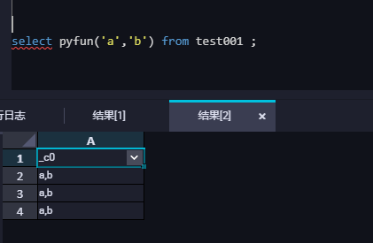

[toc]

# MaxCompute  Upload Python Function

**document support**

ysys

**date**

2020-09-25

**label**

maxcompute,upload,python,function

**level**

middle


## Background 

​	最近一个项目需要使用maxcompute,很多脚本需要到maxcompute上执行,而对于某些函数,maxcompute是没有提供个性化的，因此有必要学习一下如何创建一个在Maxcompute的函数。

## Summary

- 在文档创建时就要开始整理文档，尤其是错误问题的梳理，如果排除问题后没有记录，之后还想着复原这个流程，那就太把自己当个人了。
- 利用python写的函数就是python的函数,不要把maxcompute自带的函数当成了是python函数来调用

## Question

- 如何可以创建一个基于maxcompute的python函数
- 注册函数步骤
- 使用函数步骤

## Error

​	


## Operation

- 在`数据开发`的`业务流程`中`新建`一个后,请在下方的`MaxCompute`中的`资源`选择新建`python`的资源，资源名如'pytest001.py'
- 在新建的资源中创建python脚本

```python
from odps.udf import annotate
@annotate("string,string->string")
class concatother(object):
    def evaluate(self, one,two):
        return one+','+two
```

​	在这里`from odps.udf import annotate`必须写,`@annotate("->")`必须写，它的主要目的规定输入的参数类型,个数,输出的参数类型个数,这个`evaluate(self,..)`必须要写(感觉写完都要要求的)

- 在函数中注册该资源


- 环境测试

```
select pyfun('a','b') from test001
```



​	后续就可以将函数迁移到阿里云的maxcompute了

## Link

https://developer.aliyun.com/article/304494

https://blog.csdn.net/zhchs2012/article/details/89712537

https://juejin.im/entry/6844903604810317838

http://help.cmiiu.org/?document_detail/97075.html

https://www.jianshu.com/p/c2d18dca1422

https://help.aliyun.com/document_detail/98399.html?scm=20140722.184.2.173