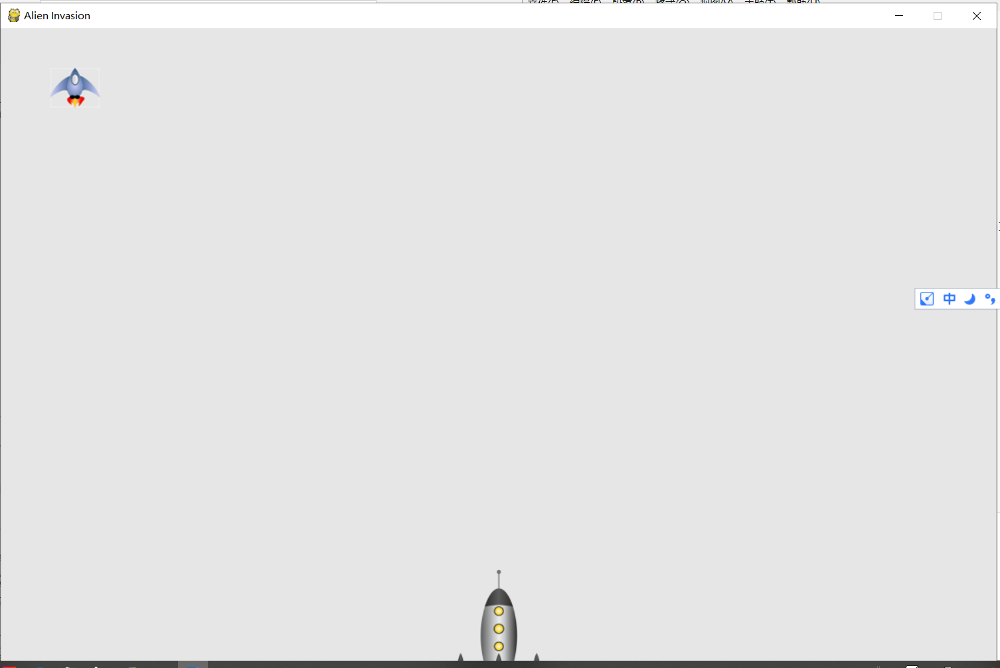

[TOC]

# 第13章 外星人

**document support**

ysys

**date**
2020-01-01

**label**

python,《Python编程：从入门到实践》

**level**

middle

## 简介

​	在游戏中添加外星人。


## 13.1 回顾项目

```
def check_keydown_events(event,ai_settings,screen,ship,bullets):
	""""响应按键"""
	if event.key == pygame.K_RIGHT:
		ship.moving_right = True
	elif event.key == pygame.K_LEFT:
		ship.moving_left = True
	elif event.key == pygame.K_SPACE:
		fire_bullet(ai_settings,screen,ship,bullets)
	elif event.key == pygame.K_q:
		sys_exit()

```


## 13.2 创建第一个外星人

### 13.2.1 创建Alien类

alien.py

```
import pygame
from pygame.sprite import Sprite

class Alien(Sprite):
	"""表示单个外星人的类"""

	def __init__(self,ai_settings,screen):
		"""初始化外星人并设置其起始位置"""
		super(Sprite,self).__init__()
		self.screen = screen
		self.ai_settings = ai_settings

		# 卸载外星人图形，并设置其rect属性
		self.image = pygame.image.load('images/alien.jpg')
		self.rect = self.image.get_rect()

		# 每个外星人最初都在屏幕左上角附件
		self.rect.x = self.rect.width
		self.rect.y = self.rect.height

		# 存储外星人的准确位置
		self.x = float(self.rect.x)

	def blitme(self):
		"""在指定位置绘制外星人"""
		self.screen.blit(self.image,self.rect)

```


### 13.2.2 创建Alien实例

​	alien_invasion.py

```
# coding=utf-8
import pygame

from settings import Settings
from ship import Ship
from alien import Alien
import game_functions as gf
from pygame.sprite import Group


def run_game():
	# 初始化游戏并创建一个屏幕对象
	pygame.init()
	ai_settings =Settings()
	screen = pygame.display.set_mode((ai_settings.screen_width,ai_settings.screen_height))

	pygame.display.set_caption("Alien Invasion")
	
	#创建一艘飞船
	
	ship = Ship(ai_settings,screen)
	#设置背景色
	# bg_color = (230,230,230)
	#开始游戏主循环
	
	#创建一个用于存储子弹的编组
	bullets = Group()
	
	# 创建一个外星人
	alien = Alien(ai_settings,screen)
	
	while True:
		# 监视键盘和数票事件
		gf.check_events(ai_settings,screen,ship,bullets)
		ship.update()
		gf.update_bullets(bullets)
		gf.update_screen(ai_settings,screen,alien,ship,bullets)

run_game()

```


### 13.2.3 让外星人出现在屏幕上


```
# coding=utf-8

import sys
import pygame
from ship import Ship
from bullet import Bullet


def check_keydown_events(event,ai_settings,screen,ship,bullets):
	""""响应按键"""
	if event.key == pygame.K_RIGHT:
		ship.moving_right = True
	elif event.key == pygame.K_LEFT:
		ship.moving_left = True
	elif event.key == pygame.K_SPACE:
		fire_bullet(ai_settings,screen,ship,bullets)
	elif event.key == pygame.K_q:
		sys_exit()

def fire_bullet(ai_settings,screen,ship,bullets):
	if len(bullets) < ai_settings.bullet_allowed:
		new_bullet =Bullet(ai_settings,screen,ship)
		bullets.add(new_bullet)

def check_keyup_events(event,ship):
	"""响应松开"""
	if event.key == pygame.K_RIGHT:
		ship_moving_right = False
	elif event.key == pygame.K_LEFT:
		ship_moving_left = False


def update_bullets(bullets):

	bullets.update()

	# 删除已消失的子弹
	for bullet in bullets.copy():
		if bullet.rect.bottom <= 0:
			bullets.remove(bullet)


def check_events(ai_settings,screen,ship,bullets):
	"""响应按键和鼠标事件"""
	for event in pygame.event.get():
		if event.type == pygame.QUIT:
			sys.exit()
		elif event.type == pygame.KEYDOWN:
			check_keydown_events(event,ai_settings,screen,ship,bullets)
		elif event.type == pygame.KEYUP:
			check_keyup_events(event,ship)

def update_screen(ai_settings,screen,ship,alien,bullets):
	# 每次循环时都重新绘制屏幕
	screen.fill(ai_settings.bg_color)
	for bullet in bullets.sprites():
		bullet.draw_bullet()
	ship.blitme()
	alien.blitme()
	# 让最近绘制的屏幕可见
	pygame.display.flip()


```




## 13.3 创建一群外星人


### 13.3.1 确定一行可容纳多少个外星人


```
available_space_x = ai_settings.screen_width - (2 * alien_width)
```


```
number_aliens_x = available_space_x / (2* alien_width)
```

