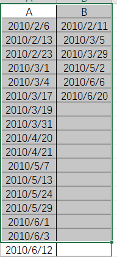

[toc]

# 某人多点行程 时间链表

**document support**

ysys

**date**

2020-09-23,2020-09-24

**label**

point,time

**level**

middle


## Test(postgresql)

### 测试场景:某人在一点活动的时间序列图

```
create table test004(name text,id int4,pointtime date);
comment on table test004 is '测试脚本';
comment on column test004.name is '人员id';
comment on column test004.id is '无用字段';
comment on column test004.pointtime is '日期字段'

--清空测试表
truncate table test004;
--插入1000条随机日期数据
insert into test004(name,id,pointtime)
select 'gh',a,get_random_date('2010-01-01','2020-01-01')::text::date from generate_series(1,1000) as a;
--删除重复日期数据
delete from test004 where pointtime in (select pointtime from test004 group by pointtime having count(1) > 1);
--得到700多条
select count(1) from test004;
 
 

```

​	lag:上个值

​	lead:下个值

```
select *,lag(pointtime)  over(partition by name order by pointtime) as lag,lead(pointtime) over(partition by name order by pointtime) as lead  from test004 
```

​	样例展示数据,可以发现pointtime和lead结果值放刚好

```
 name | id  | pointtime  |    lag     |    lead    
------+-----+------------+------------+------------
 gh   | 252 | 2010-01-10 |            | 2010-02-04
 gh   | 103 | 2010-02-04 | 2010-01-10 | 2010-02-05
 gh   | 572 | 2010-02-05 | 2010-02-04 | 2010-02-06
 gh   |  51 | 2010-02-06 | 2010-02-05 | 2010-02-11
 gh   |  18 | 2010-02-11 | 2010-02-06 | 2010-02-13
 gh   | 311 | 2010-02-13 | 2010-02-11 | 2010-02-23
 gh   | 237 | 2010-02-23 | 2010-02-13 | 2010-03-01
 gh   | 277 | 2010-03-01 | 2010-02-23 | 2010-03-04
 gh   | 463 | 2010-03-04 | 2010-03-01 | 2010-03-05
 gh   | 972 | 2010-03-05 | 2010-03-04 | 2010-03-17
```

​	要求是a-b,c-d，那么第二条数据就是不需要的，不存在中间耦合点

```

select h.name,h.id,h.pointtime as 开始时间,lag as 无效时间,lead as 结束时间,cn as xh from (select *,row_number() over(partition by name order by pointtime) as cn  from (select *,lag(pointtime)  over(partition by name order by pointtime) as lag,lead(pointtime) over(partition by name order by pointtime) as lead  from test004)t
where pointtime <> lag or lag <> lead or   lag is not null or lead is not  null order by pointtime) h where mod(h.cn,2)=1;
```

​	样例数据

```
 name | id  |  开始时间  |  无效时间  |  结束时间  | xh 
------+-----+------------+------------+------------+----
 gh   | 252 | 2010-01-10 |            | 2010-02-04 |  1
 gh   | 572 | 2010-02-05 | 2010-02-04 | 2010-02-06 |  3
 gh   |  18 | 2010-02-11 | 2010-02-06 | 2010-02-13 |  5
 gh   | 237 | 2010-02-23 | 2010-02-13 | 2010-03-01 |  7
 gh   | 463 | 2010-03-04 | 2010-03-01 | 2010-03-05 |  9
 gh   | 435 | 2010-03-17 | 2010-03-05 | 2010-03-19 | 11
 gh   | 870 | 2010-03-29 | 2010-03-19 | 2010-03-31 | 13
 gh   | 751 | 2010-04-20 | 2010-03-31 | 2010-04-21 | 15
 gh   | 914 | 2010-05-02 | 2010-04-21 | 2010-05-05 | 17
 gh   | 264 | 2010-05-06 | 2010-05-05 | 2010-05-07 | 19
```

### 测试场景:某人在两点活动的时间序列图

​	如在1处即为A,2处即为B(将之前的id转换为1,2)

```
update test004 set id =1 where mod(id,2)=1;

update test004 set id =2 where id <> 1;
```


​	这个时候我们要找好参照点,假设都是从1-2,那么就要定位A就可以了，在通过B在A的时间内来获取最小值即可



​	所以第一步还是这么做只不是需要添加id = 1

```
select *,lag(pointtime)  over(partition by name order by pointtime) as lag,lead(pointtime) over(partition by name order by pointtime) as lead  from test004 where id = 1
```

​	第二步就是从2中获取在A的区间范围最小值

```
select t.name,t.id,pointtime as ksrq,(select min(z.pointtime) from test004 z where z.id = 2 and z.pointtime > t.pointtime and z.pointtime < t.lead) as jsrq ,row_number() over(partition by name order by pointtime) as cn  from (
select *,lag(pointtime)  over(partition by name order by pointtime) as lag,lead(pointtime) over(partition by name order by pointtime) as lead  from test004 where id = 1)t
where pointtime <> lag or lag <> lead or   lag is not null or lead is not  null order by pointtime;
```

​	样例数据

```
 name | id |    ksrq    |    jsrq    | cn 
------+----+------------+------------+----
 gh   |  1 | 2010-02-04 | 2010-02-05 |  1
 gh   |  1 | 2010-02-06 | 2010-02-11 |  2
 gh   |  1 | 2010-02-13 |            |  3
 gh   |  1 | 2010-02-23 |            |  4
 gh   |  1 | 2010-03-01 |            |  5
 gh   |  1 | 2010-03-04 | 2010-03-05 |  6
 gh   |  1 | 2010-03-17 |            |  7
 gh   |  1 | 2010-03-19 | 2010-03-29 |  8
 gh   |  1 | 2010-03-31 |            |  9
 gh   |  1 | 2010-04-20 |            | 10
```

## think

​	那么某人在多点的时序图如何计算呢？

​	关键还是定位那个为起始,利用递归语句


## link 

http://www.postgres.cn/docs/9.4/functions-window.html

