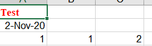
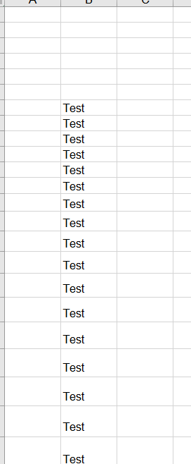
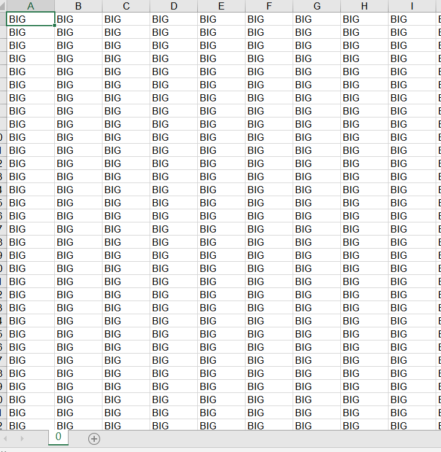
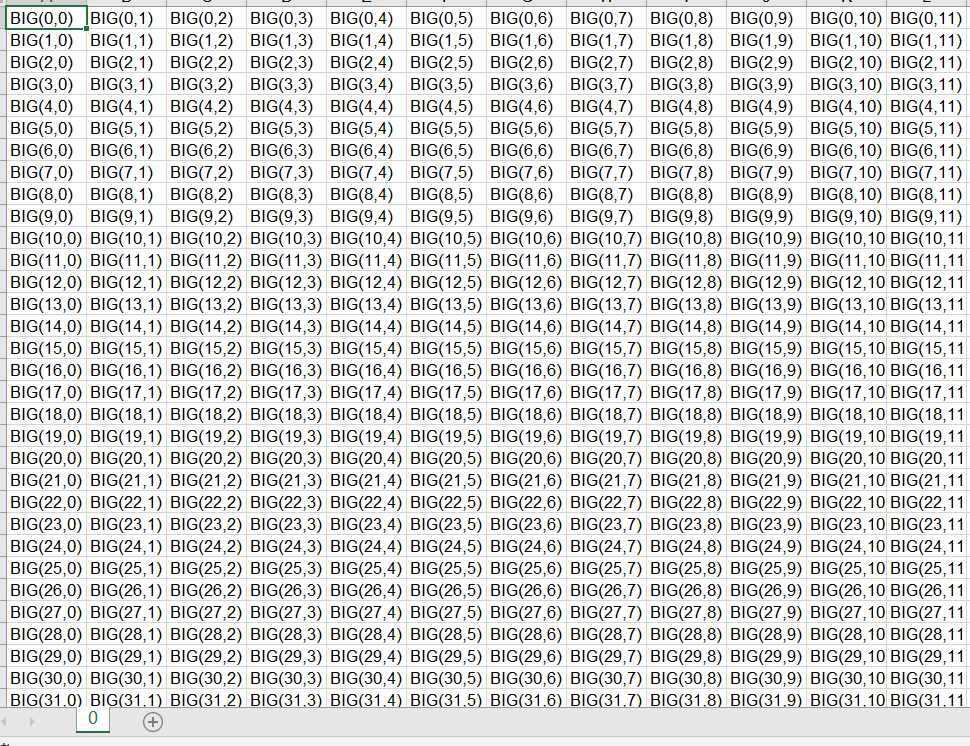
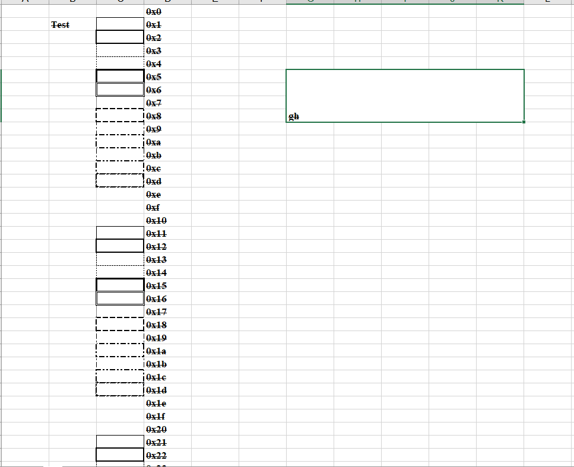
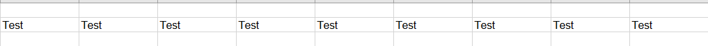
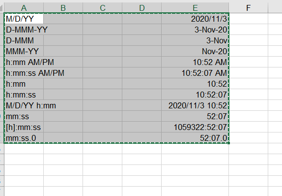
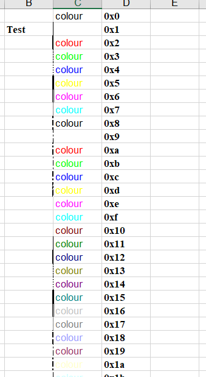
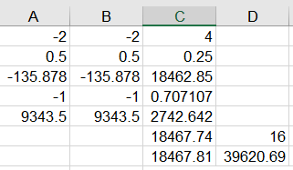

[toc]

# Python:xlwt 学习样例

**document support**

ysys

**date**

2020-11-02

**label**

python,xlwt,xls


## Knowledge

​	有些东西还是一知半解

### simply.py

```
#coding=utf-8

from datetime import datetime

import xlwt

font0 = xlwt.Font()
font0.name = 'Times New Roman' #某种字体
font0.colour_index = 2 
font0.bold = True

style0 = xlwt.XFStyle()
style0.font = font0


style1 = xlwt.XFStyle()
style1.num_format_str = 'D-MMM-YY'

wb = xlwt.Workbook()
ws = wb.add_sheet('A Test Sheet')

ws.write(0,0,'Test',style0)
ws.write(1,0,datetime.now(),style1)
ws.write(2,0,1)
ws.write(2,1,1)
ws.write(2,2,xlwt.Formula("A3+B3"))

wb.save('example_11.xls')
```



​	样例数据主要是颜色，日期格式，计算公式

### row_styles.py

```
from xlwt import *

w = Workbook()
ws = w.add_sheet('Hey,Dude')

for i in range(6,80):
	fnt = Font()
	fnt.height = i*20 #宽度
	style = XFStyle()
	style.font = fnt
	ws.write(i,1,'Test')
	ws.row(i).set_style(style)
	
w.save('example_11.xls')
```





​	其中主要字段宽度变大

​	其中row_styles_empty.py的`pyExcelerator`并没有安装，暂时不准备安装

### big-16Mb.py

```
#coding=utf-8

from __future__ import print_function

from time import *

from xlwt.Style import *
from xlwt.Workbook import *

style = XFStyle()

wb = Workbook()

ws0 = wb.add_sheet('0')

colcount = 200 + 1
rowcount = 6000 + 1

t0 = time()
print("\nstart: %s" % ctime(t0))

print("filling...")

for col in range(colcount):
	print("[%d" %col,end =' ')
	for row in range(rowcount):
		ws0.write(row,col,"BIG")
		
t1 = time() - t0
print("\nsince starting elapsed %.2f s" % (t1))

print("Storing...")
wb.save('example11.xls')

t2 = time() - t0
print("since starting elapsed %.2f s" % (t2))

```



​	插入很多数据

### big-35Mb.py

```
#coding=utf-8

from __future__ import print_function

from time import *

from xlwt.Style import *
from xlwt.Workbook import *

style = XFStyle()

wb = Workbook()

ws0 = wb.add_sheet('0')

colcount = 200 + 1
rowcount = 6000 + 1

t0 = time()
print("\nstart: %s" % ctime(t0))

print("filling...")

for col in range(colcount):
	for row in range(rowcount):
		ws0.write(row,col,"BIG(%d,%d)" % (row,col))
		
t1 = time() - t0
print("\nsince starting elapsed %.2f s" % (t1))

print("Storing...")
wb.save('example11.xls')

t2 = time() - t0
print("since starting elapsed %.2f s" % (t2))
```

​	相较前者，字段值更大，空间更大




### blanks.py

```
#coding=utf-8

from xlwt import *

font0 = Font()
font0.name = 'Times New Roman'
font0.struck_out = True
font0.bold = True

style0 = XFStyle()
style0.font = font0

wb = Workbook()
ws0 = wb.add_sheet('0')

ws0.write(1,1,'Test',style0)

for i in range(0,0x53):
	borders = Borders()
	borders.left = i
	borders.right = i
	borders.top = i
	borders.bottom = i
	
	style = XFStyle()
	style.borders = borders
	
	ws0.write(i,2,'',style)
	ws0.write(i,3,hex(i),style0)
	
ws0.write_merge(5,8,6,10,"gh",style0)

wb.save('example.xls')

```





​	从这里可以看出各种框边，以及合并单元格问题


### col_width.py

```
#coding=utf-8

__rev_id__ = """$Id$"""

from xlwt import *

w =Workbook()
ws = w.add_sheet('Hey,Dude')

for i in range(6,80):
	fnt = Font()
	fnt.height =i*20
	style =XFStyle()
	style.font = fnt
	ws.write(1,i,'Test')
	ws.col(i).width=0x0d00 + i
	
w.save('example.xls')
```




​	从这里看出宽度有变化()


### country.py

```
#coding=utf-8

from xlwt import *

w = Workbook()
w.country_code = 61
ws = w.add_sheet('AU')
w.save('country.xls')

```

​	没看出来什么


### dates.py

```
#coding=utf-8

from datetime import datetime

from xlwt import *

w = Workbook()
ws = w.add_sheet('Hey,Dude')

fmts = [
	'M/D/YY',
	'D-MMM-YY',
	'D-MMM',
	'MMM-YY',
	'h:mm AM/PM',
	'h:mm:ss AM/PM',
	'h:mm',
	'h:mm:ss',
	'M/D/YY h:mm',
	'mm:ss',
	'[h]:mm:ss',
	'mm:ss.0',
]

i = 0
for fmt in fmts:
	ws.write(i,0,fmt)
	
	style =XFStyle()
	style.num_format_str = fmt
	
	ws.write(i,4,datetime.now(),style)
	
	i +=1
	
w.save('example.xls')

```




​	从这里可以看出各个日期表示方式


### format.py

```
#coding=utf-8

from xlwt import *

font0 = Font()
font0.name = 'Times New Roman'
font0.stuck_out = True
font0.bold = True

style0 = XFStyle()
style0.font = font0

wb = Workbook()
ws0 = wb.add_sheet('0')

ws0.write(1,1,'Test',style0)

for i in range(0,0x53):
	fnt = Font()
	fnt.name = 'Arial'
	fnt.colour_index = i
	fnt.outline = True
	
	
	borders = Borders()
	borders.left = i
	
	style = XFStyle()
	style.font = fnt
	style.borders = borders
	
	ws0.write(i,2,'colour',style)
	ws0.write(i,3,hex(i),style0)
	
wb.save('example.xls')

```


​	可以看出颜色样子。



​	


### formulas.py 

```
#coding=utf-8

from xlwt import *

w = Workbook()
ws = w.add_sheet('F')

ws.write(0,0,Formula("-(1+1)"))
ws.write(1,0,Formula("-(1+1)/(-2-2)"))
ws.write(2,0,Formula("-(134.8780789+1)"))
ws.write(3,0,Formula("-(134.8780789e-10+1)"))
ws.write(4,0,Formula("-1/(1+1)+9344"))


ws.write(0,1,Formula("-(1+1)"))
ws.write(1,1,Formula("-(1+1)/(-2-2)"))
ws.write(2,1,Formula("-(134.8780789+1)"))
ws.write(3,1,Formula("-(134.8780789e-10+1)"))
ws.write(4,1,Formula("-1/(1+1)+9344"))


ws.write(0,2,Formula("A1*B1"))
ws.write(1,2,Formula("A2*B2"))
ws.write(2,2,Formula("A3*B3"))
ws.write(3,2,Formula("A4*B4*sin(pi()/4)"))
ws.write(4,2,Formula("A5%*B5*pi()/1000"))


ws.write(5, 2, Formula("C1+C2+C3+C4+C5/(C1+C2+C3+C4/(C1+C2+C3+C4/(C1+C2+C3+C4)+C5)+C5)-20.3e-2"))
ws.write(5, 3, Formula("C1^2"))
ws.write(6, 2, Formula("SUM(C1;C2;;;;;C3;;;C4)"))
ws.write(6, 3, Formula("SUM($A$1:$C$5)"))

ws.write(7, 0, Formula('"lkjljllkllkl"'))
ws.write(7, 1, Formula('"yuyiyiyiyi"'))
ws.write(7, 2, Formula('A8 & B8 & A8'))
ws.write(8, 2, Formula('now()'))

ws.write(10, 2, Formula('TRUE'))
ws.write(11, 2, Formula('FALSE'))
ws.write(12, 3, Formula('IF(A1>A2;3;"hkjhjkhk")'))


w.save('example.xls')

```

​	 从这里看出公式计算的样子




​	formula_names.py这个有个报错`AttributeError: module 'xlwt.ExcelMagic' has no attribute 'std_func_by_name'`


## Link

https://github.com/python-excel/xlwt/tree/master/examples

