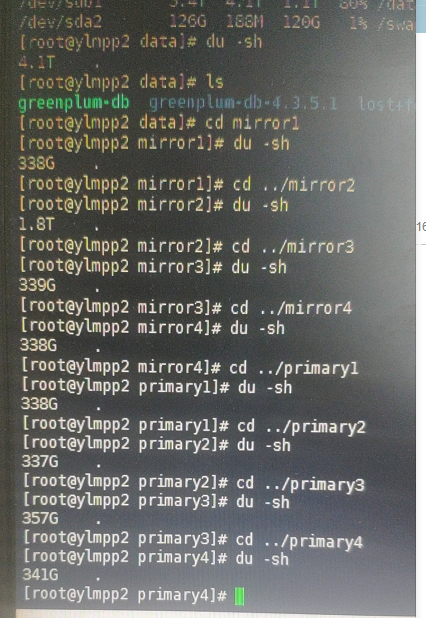

[toc]

# greenplum data skew

**document support**

ysys

**date**

2020-09-11

**label**

greenplum,data skew

**level**

middle

## background

​	这两天有个地方的gp数据库严重数据倾斜

​	可以发现某个节点上明显大于其他节点

## operation

​	select gp_segment_id,count(1) from table group by gp_segment_id;

​	其中gp_segment_id是表table的字段,pg_attribute中就有该字段,是gp创建表时默认自带(oracle rowid),gp_segment_id对着是`gp_segment_configuration的content`

​	这个sql只能查看某张表，只是大致上查看了数据情况

