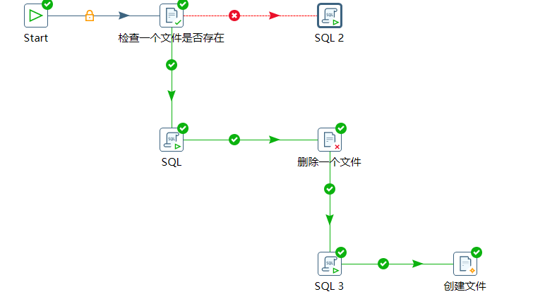
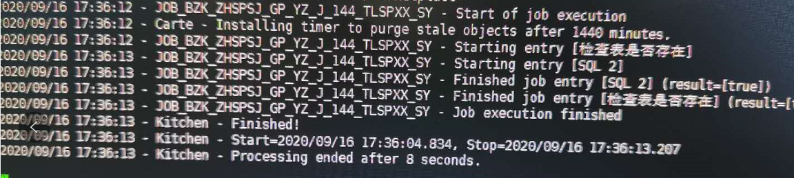

[TOC]

# Kettle Case:跳过条件执行

**document support**

ysys

**date**

2020-09-16

**label**

linux,kettle,crontab,skip

## background 

​	虽然kettle有图形化的调度设置，可是对于现场来说是不现实的，由于一直开着界面会导致内存不会释放，从而导致内存溢出，kettle崩溃。那么就要通过linux,或者其他调度工具来完成这个操作。

## global

- kettle 设置一个跳过机制
- linux 每隔一段时间调度

## exercise

​	这个想法监测一个文件是否存在，如果不存在，执行报错，进入到下个报错处理，当文件存在的时候，进入正常的流程，同时将该文件删除，删除后执行正常的流程直到正常流程结束，再次创建文件，在中间的过程中，如果方案再次被调度，那么就会出现执行sql_2的流程，而不会影响正常的流程。

​	记得之前的时候是为了判断表的数据量如果是0，那么就不进行后面流程的处理，现在拿过来改了改

为了放置linux配置的时间调度出现问题。

实战化

​	开发环境是windows服务器,生产环境是linux服务器,就改成检测表是否存在

​	而linux调度请参考文档[linux crontab](../201706/20170601_07.md)

## link

[kettle job judeg null](../201705/20170504_05.md)

[linux crontab](../201706/20170601_07.md)