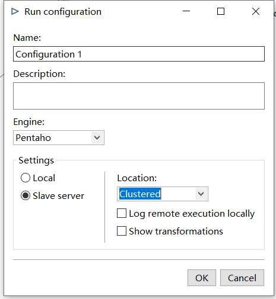
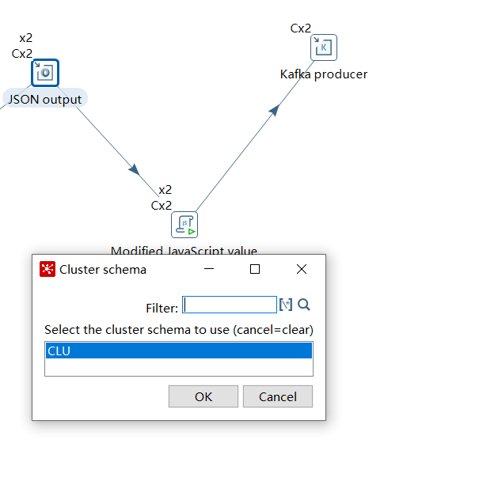
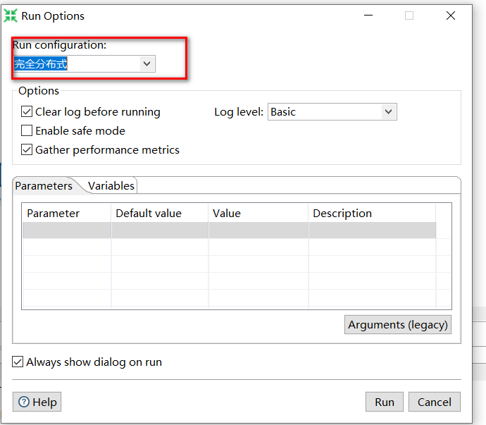

[toc]

# kettle cluster 8.2 install on centos 7

**document support**

ysys

**date**

2020-09-18

**label**

kettle,cluster,8.2,centos,7.3,install

**level**

middle


## summary

​	部署过程中遇到在图形化中没有找到集群调度,以为是自己部署有问题,部署了好几遍,发现依然调试不出来,甚至部署了一个高版本9.x,还是没有出现,后来在某篇文档中找到需要自己手工配置,给自己的总结就是,版本不一样,可能某些东西就不在或者需要手工配置。要去官网或者一些准确的网站搜索,还有一点就是努力学习英文文档,给自己一个进步的机会。

## background

​	最近需要整理在centos7上部署kettle8.2的集群版本,整理成一个文档。


## operation

- 修改主机名[所有服务器]

```
# vim /etc/hosts
192.168.1.114 gh114
192.168.1.115 gh115
192.168.1.116 gh116
```

- 上传文件并解压[所有服务器]

```
# mkdir -p /software
..通过xftp上传文件
## unzip pdi-ce-8.2.0.0-342.zip
```

- linux 安装 java 1.8 环境[所有服务器]

[linux uninstall openjdk](../201806/20180626_03.md)

- 关闭防火墙和Selinux安全策略[所有服务器]

[Basic Linux:Firewall and Selinux](20201225_01.md)

- 修改master[master]

```
# vim /opt/data-integration/pwd/carte-config-master-8080.xml 
<slave_config>
  <slaveserver>
    <name>master</name>
    <hostname>192.168.1.114</hostname>
    <port>8080</port>
    <master>Y</master>
    <username>cluster</username>
    <password>cluster</password>
  </slaveserver>
</slave_config>
```

- 修改slave1[slave1]

```
# vim /opt/data-integration/pwd/carte-config-8081.xml 
<slave_config>
  <masters>
    <slaveserver>
      <name>master</name>
      <hostname>192.168.1.114</hostname>
      <port>8080</port>
      <username>cluster</username>
      <password>cluster</password>
      <master>Y</master>
    </slaveserver>
  </masters>
  <report_to_masters>Y</report_to_masters>
  <slaveserver>
    <name>slave1-8081</name>
    <hostname>192.168.1.115</hostname>
    <port>8081</port>
    <username>cluster</username>
    <password>cluster</password>
    <master>N</master>
  </slaveserver>
</slave_config>
```

- 修改slave2配置[slave2]

```
#  vim /opt/data-integration/pwd/carte-config-8082.xml 
<slave_config>
  <masters>
    <slaveserver>
      <name>master</name>
      <hostname>192.168.1.114</hostname>
      <port>8080</port>
      <username>cluster</username>
      <password>cluster</password>
      <master>Y</master>
    </slaveserver>
  </masters>
  <report_to_masters>Y</report_to_masters>
  <slaveserver>
    <name>slave2-8082</name>
    <hostname>192.168.1.116</hostname>
    <port>8082</port>
    <username>cluster</username>
    <password>cluster</password>
    <master>N</master>
  </slaveserver>
</slave_config>
```

​	在这里不建议将`hostname`改为主机名，主要的原因是可能你的开发环境下不会读到主机名的映射配置

- 启动各个节点carte服务[所有服务器]

```
[master]

# ./carte.sh 192.168.1.114 8080

[slave1]

# ./carte.sh 192.168.1.115 8081


[slave2]

# ./carte.sh 192.168.1.116 8082

```


- 资源库配置(开发环境下,可以在windows下直接打开相关软件)

[Kettle Database Repository](../201806/20180615_03.md)

- 配置slave server

  [注] 配置中没有保留截图,使用了kettle 5.4版本配置


- 配置kettle cluster schema


- 配置启动选择项

  新建一个方案后在`Run configurations`中配置一个集群启动选项



​	

- 选择集群选项并启动

  在方案中的具体按钮中右击出现cluster,点击选择后选择集群名称就可以了



  

  


## link

https://help.pentaho.com/Documentation/8.2/Products/Data_Integration/Carte_Clusters/Setup

https://zhuanlan.zhihu.com/p/182509839