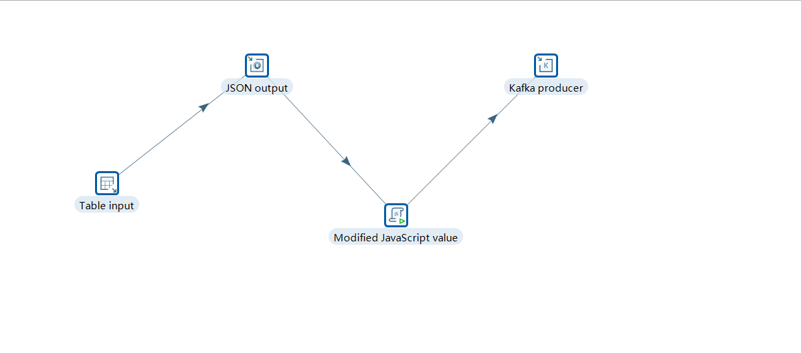
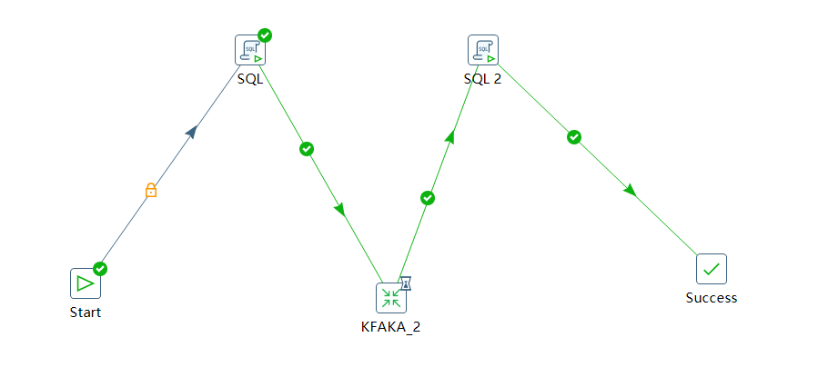
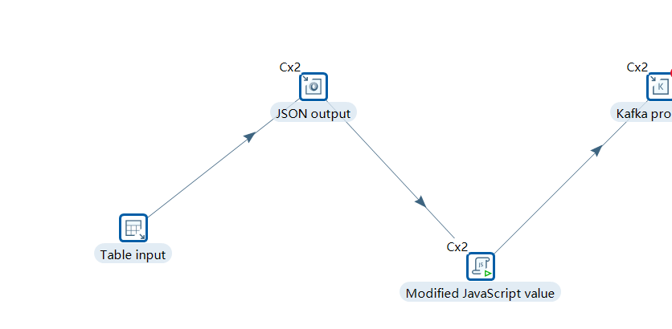
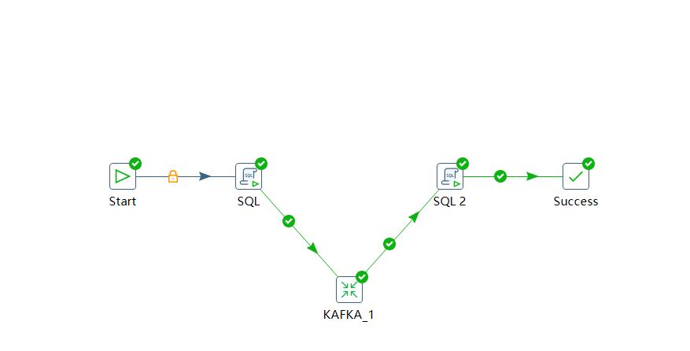

[toc]

# Integrative Case:Kettle Cluster vs Kettle Single synchronization Kafka Cluster

**document support**

ysys

**date**

2020-09-17

**label**

kettle,kafka,etl

**level**

middle


## background

​	最近某项目发现数据同步到kafka效率有的慢,那么就要看看使用集群是否可以加快数据同步的速度

## kettle single

**准备环境**

| 软件      | 版本 | 台数 |
| --------- | ---- | ---- |
| kettle    | 8.2  | 1    |
| kafka     | 2.1  | 1    |
| greenplum | 6.4  | 3    |

## kettle cluster kafka cluster

**准备环境**

| 软件      | 版本 | 台数 |
| --------- | ---- | ---- |
| kettle    | 8.2  | 3    |
| kafka     | 2.3  | 3    |
| greenplum | 6.4  | 3    |

##  测试场景

​	生成1-10000000左右的序列数据，看看数据同步要多长时间

```
postgres=# insert into test001 select generate_series(1,1000000),'guoh';

postgres=# insert into test002 select generate_series(1,1000000),'guok';

```

## 思路

### kettle 原始方案如下








### kettle 集群方案如下




 

​	其实主要测试数据库同步到kafka集群就可以了(kafka都在测试集群,但是本质上还是单机)

​	其中test001代表集群方案test002代表单机方案

```
postgres=# select * from test003;
   bm    |         sj          
---------+---------------------
 test001 | 2020-09-20 09:40:08
 test001 | 2020-09-20 09:40:49
 test002 | 2020-09-20 09:41:29
 test002 | 2020-09-20 09:41:40
```

​	将数据量调到200万级别

```
postgres=# select * from test003;
   bm    |         sj          
---------+---------------------
 test002 | 2020-09-20 09:43:55
 test002 | 2020-09-20 09:44:12
 test001 | 2020-09-20 09:44:26
 test001 | 2020-09-20 09:46:09
(4 rows)
```

​	将数据量调至500万级别

```
postgres=# select * from test003;
   bm    |         sj          
---------+---------------------
 test002 | 2020-09-20 09:50:08
 test002 | 2020-09-20 09:50:47
 test001 | 2020-09-20 09:51:03
 test001 | 2020-09-20 09:56:01
```

​	还是发现kettle单机比kettle集群更有优势


## summary

​	本次结论是集群kettle并不会比单机kettle优秀很多。


## think

​	 本次测试发现，集群kettle并没有如之前预想的那样比单机kettle优秀很多，反而时间上还比之很慢。这就是个可以思考的问题？

- 本次部署的kettle集群有问题
- 本次配置的kettle集群方案有问题
- 本次单机测试环境是否和kettle集群环境不构成盲测标准
- 本次样例数据过少,数据结构过于单一


## mirror

[kettle_kafka_cluster_8](../../mirror/kettle_kafka_cluster_8.ktr)

[kettle_kafka_8](../../mirror/kettle_kafka_8.ktr)

