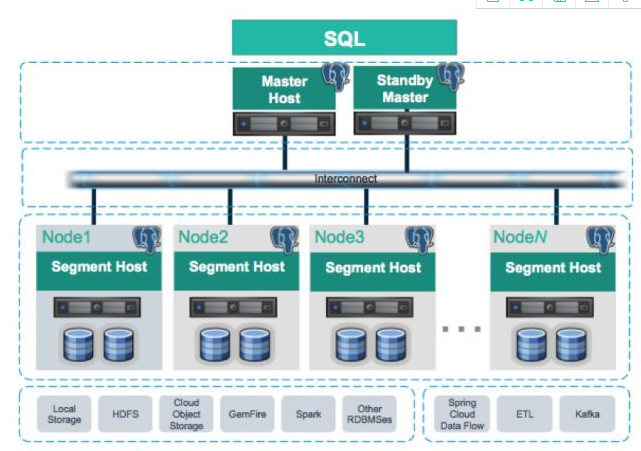

[toc]

# 第4章 Greenplum数据库快速入门

**document support**
ysys

**date**

2021-06-12

**label**

Greenplum,《Greenplum从大数据战略到实现》


## 概览

​	略

## 4.1 Greenplum数据库的发展和现状

​	略

## 4.2 Greenplum数据库的特性

- 开放源代码
- 超大规模和高性能
- 高可用性
- 通用性
- 多态存储
- 高扩展性和高效资源管理
- 高效数据加载
- 高级数据分析
- 良好的监控管理和运维体验


## 4.3 Greenplum数据库的组成

​		Greenplum 数据库时典型的Master/Slave架构,一个Greenplum集群通常由一个Master节点,一个Standby Master节点以及多个Segment节点组成,节点之间通常告诉网络互联。




## 4.4 Greenplum数据库的安装与部署

​	安装与部署Greenplum数据库主要有以下三个步骤:1)常规的准备工作;2)安装并验证;3)初始化数据库

### 4.4.1 准备工作

| 软硬件   | 配置要求                                                     |
| -------- | ------------------------------------------------------------ |
| CPU      | Intel Pentium Pro 兼容,P3以上处理器,AMD Athlon以上处理器     |
| 内存     | 每个节点至少16GB RAM*                                        |
| 操作系统 | 1)SUSE Linux Enterprise Server 64-bit 12 SP2 ,SP3 或者更新版本，SUSE Linux Enterprise Server 64-bit 11 SP4         2)Centos 64-bit 6.x或者7.x |
| 文件系统 | SUSE和Redhat需要XFS文件系统*,根文件系统需要支持ext3          |
| 网络     | 节点间使用10GB以太网                                         |
| 磁盘     | Greenplum安装每个节点需要150MB，每个节点的元数据约占用300MB  |

​	部署Greenplum时,需要对各节点的操作系统参数进行配置，主要包括三个部分:共享内存,网络参数以及用户资源限制


### 4.4.2 安装Greenplum

- 安装Master节点

  - RPM包方式安装
  - 二进制方式安装

- 安装其他节点

  

### 4.4.3 初始化Greenplum数据库

- 创建并配置gpinitsystem_config

- 运行初始化命令

  ```
  gpinitsystem -c gpinitsystem_config -h seg_hosts
  gpinitsystem -c gpinitsystem_config -h seg_hosts -s standby_master_hostname
  ```


## 4.5 Greenplum数据库的常用操作

```
postgres=# create database sample;
CREATE DATABASE
postgres=# \c sample
You are now connected to database "sample" as user "gpadmin".
sample=# create table t1(c1 int) distributed by (c1);
CREATE TABLE
sample=# insert into t1 select generate_series(1,1000);
INSERT 0 1000
sample=# select count(*) from t1;
 count 
-------
  1000
(1 row)
```


## 4.6 Greenplum数据库的常用命令

### 4.6.1 gpstart

​	启动数据库`gpstart -a`

​	只启动Master,而不是Segment节点`gpstart -m`，访问命令`PGOPTIONS='-c gp_session_role=utility'` psql

### 4.6.2 gpstop

- -r停止并重启数据库
- -m关闭以维护模式启动的Master
- -M fast任何进行中的事务都会中断并回滚
- -M immediate任何进行的事务都会中止。这种模式不会允许数据库做一些事务处理或者任何临时文件,而是直接杀掉所有的postgres进程
- -M smart如果有活跃连接，这条命令会失败并提示警告信息，这是默认的关闭方式
- -u重新加载pg_hba.conf和postgresql.conf文件,但是不会关闭整个数据库系统。这种方式用于运行期间重新加载修改后的配置参数

### 4.6.3 gpstate

​	gpstate -s

### 4.6.4 gpactivatestandby

​	gpactivatestandby -s $MASTER_DATA_DIR

### 4.6.5 gpconfig

 	gpconfig -c max_connections -v 100 -m 10

​	设置参数max_connections的segment是100,master节点是10


### 4.6.6 gpdeletesystem

​	删除数据库系统

​	gpdeletesystem  -d /gpdata


### 4.6.7 其他参数

​	略


## 4.7 小结


