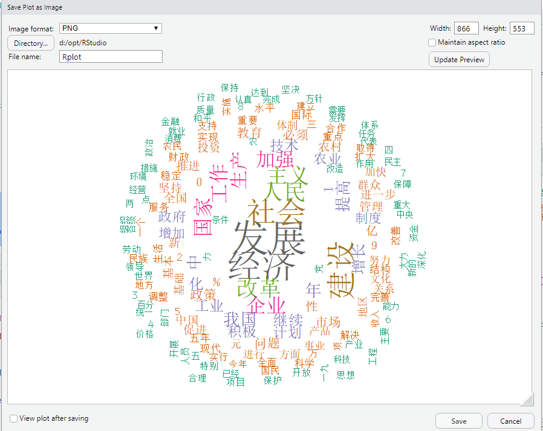

[TOC]

# R language chinese text handing

**document support**

ysys

**date**

2020-03-20

**label**

R,R language,chinese,text handing,text


## background

​	之前在查询一些资料时,发现一篇文档很有趣,就是最后出现的一个图片,因为都是文档都是英语写的,我感觉自己的英语水平很难看懂。借助有道词典一起来好好看看这篇文档到底在写一些什么东西

[《chinese text handing》](https://cran.r-project.org/web/packages/corpus/vignettes/chinese.html)


## step


### 下载安装包

​	需要已知如下的包(install.packages())

```
corpus,httr,stringi,wordcloud
```

### 加载安装包

```
> library(corpus)
> library(httr)
> library(stringi)
> library(wordcloud)
```

​	

## 全量脚本

```
library(corpus)
library(httr)
library(stringi)
library(wordcloud)

set.seed(100)

cstops <- "https://raw.githubusercontent.com/ropensci/textworkshop17/master/demos/chineseDemo/ChineseStopWords.txt"
csw <- paste(readLines(cstops, encoding = "UTF-8"), collapse = "\n") 
csw <- gsub("\\s", "", csw) 
csw
stop_words <- strsplit(csw, ",")[[1]]
stop_words

gov_reports <- "https://api.github.com/repos/ropensci/textworkshop17/contents/demos/chineseDemo/govReports"
raw <- httr::GET(gov_reports)
paths <- sapply(httr::content(raw), function(x) x$path)
names <- tools::file_path_sans_ext(basename(paths))
urls <- sapply(httr::content(raw), function(x) x$download_url)
text <- sapply(urls, function(url) paste(readLines(url, warn = FALSE,
                                                   encoding = "UTF-8"),
                                         collapse = "\n"))
names(text) <- names

toks <- stringi::stri_split_boundaries(text, type = "word")
dict <- unique(c(toks, recursive = TRUE)) # unique words
text2 <- sapply(toks, paste, collapse = "\u200b")


data <- corpus_frame(name = names, text = text2)

f <- text_filter(drop_punct = TRUE, drop = stop_words, combine = dict)
(text_filter(data) <- f) # set the text column's filter

text_stats(data)

(stats <- term_stats(data))

font_family <- par("family") # the previous font family
par(family = "STSong") # change to a nice Chinese font
with(stats, {
  wordcloud::wordcloud(term, count, min.freq = 500,
                       random.order = FALSE, rot.per = 0.25,
                       colors = RColorBrewer::brewer.pal(8, "Dark2"))
})


```


