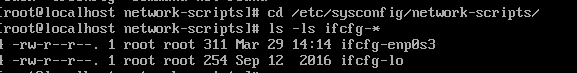
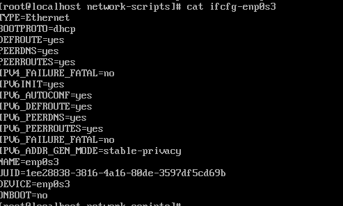

[TOC]

# linux centos 7 install min and network not configure

**document support**

ysys

**date**

2020-3-29

**label**

linux,centos,centos 7.x,install,min,network configure


## summary

​	之前以为最小化安装可能导致某些关于网络的文件或者包没有安装，导致后续调试比较麻烦，不过经过测试发现，最小化安装以及没有配置网络的情况下并不会影响后面网络的配置，只要找到网络地址就可以使用vi编辑模式编辑了。

​	另外测试发现yum可以使用，很多命令如ifconfig等无法使用。可以后期安装这些命令包


## background

​	最近一段时间遇到如下的情况,就是不知道具体的原因，但是无法在服务器使用图形化界面安装操作系统，而通过命令行安装操作系统一些配置非常麻烦。现在重现一些主要的问题点。


## solution

### question

​	最小化安装并且网络没有设置

```
# ifconfig
-bash:ifconfig:command not found
```


```
# cd /etc/sysconfig/network-scripts/
# ls -ls ifcfg*
```



当时了解到都没有这个目录(network-scripts,可能是文件名敲错了吧,最小化安装也都是有的,其他模式应该也是有的)

```
# cat ifcfg-enp0s3
```




### vi ifcfg-xxxx

```
# vi ifcfg-enp0s3

TYPE=Ethernet
BOOTPROTO=none
DEFROUTE=yes
#PEERDNS=yes
#PEERROUTES=yes
IPV4_FAILURE_FATAL=no
IPV6INIT=yes
IPV6_AUTOCONF=yes
IPV6_DEFROUTE=yes
IPV6_PEERDNS=yes
IPV6_PEERROUTES=yes
IPV6_FAILURE_FATAL=no
#IPV6_ADDR_GEN_MODE=stable-privacy
NAME=enp0s3
UUID=68720391-f589-4184-abf6-ac1c72206c71
DEVICE=enp0s3
ONBOOT=yes
IPADDR=192.168.1.201
PREFIX=28
GATEWAY=192.168.1.1
IPV6_PEERDNS=yes
IPV6_PEERROUTES=yes
```

​	虚拟机并没有添加dns,添加后可以更在GATEWAY后面即可

```
DNS1=x.x.x.x
```

​	重启网络服务

```
# service network restart
```

​	现在网络就已经可以访问了


https://access.redhat.com/documentation/en-us/red_hat_enterprise_linux/7/html/installation_guide/sect-installation-text-mode-x86


https://centosfaq.org/centos/centos-7-will-not-install/