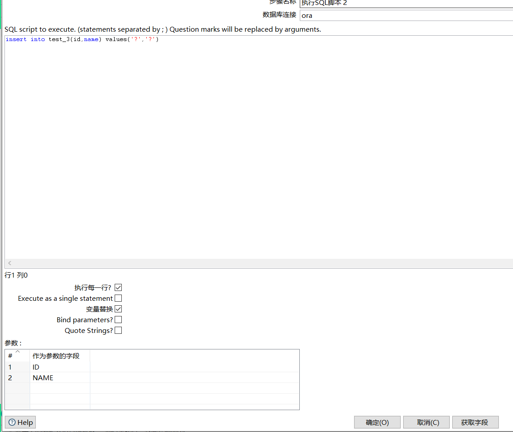

[TOC]

# kettle for loop small data big data 

**document support**

ysys

**date**

2020-4-23

**label**

kettle,sql scripts

## background

​	在oracle中两表关联可能会使用nestloop,mergejoin,hashjoin三种情况,现在是跨库访问,一个是mysql,一个是Oracle,两个数据量差距较大，一个是全表十几个亿的数据，一个是小表几百或者是几万条数据，按照kettle提供的控件合并连接,这样不现实，反而利用本身小表的字段在大表中是该索引字段，利用forloop方式解决该问题。

## test solution

​	for loop 暂不写了，后面给出链接地址

​	主要讲讲这个脚本的写法

​	首先变量替换是指可以替换${TAB_NAME}之类的替换变量

​	如果是作为参数的字段，那么就要使用ID,NAME之类的字段

## link

<https://blog.csdn.net/chenyiming2010/article/details/82705816?depth_1-utm_source=distribute.pc_relevant.none-task-blog-BlogCommendFromBaidu-2&utm_source=distribute.pc_relevant.none-task-blog-BlogCommendFromBaidu-2> 