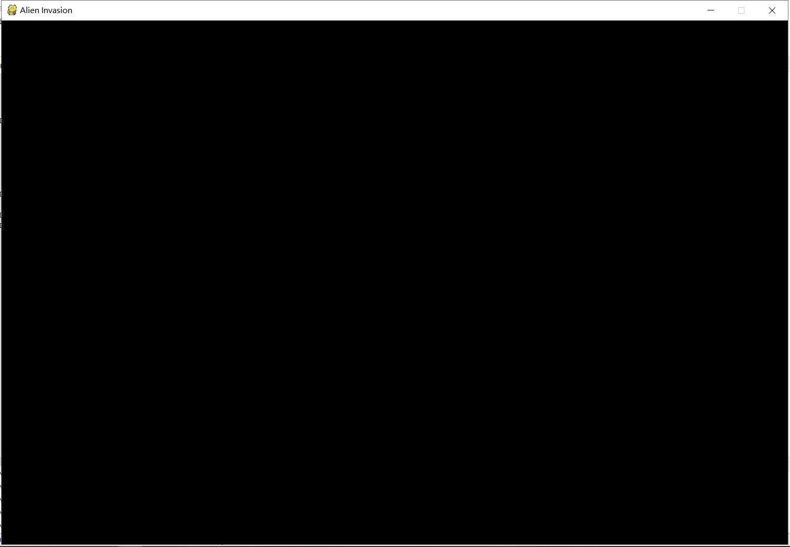
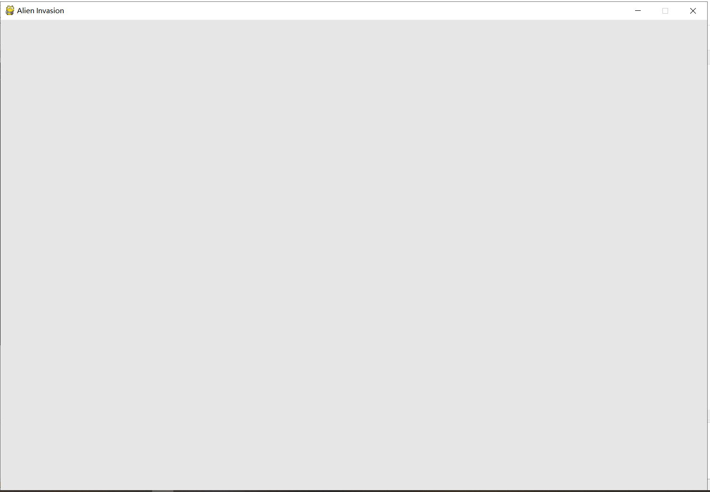
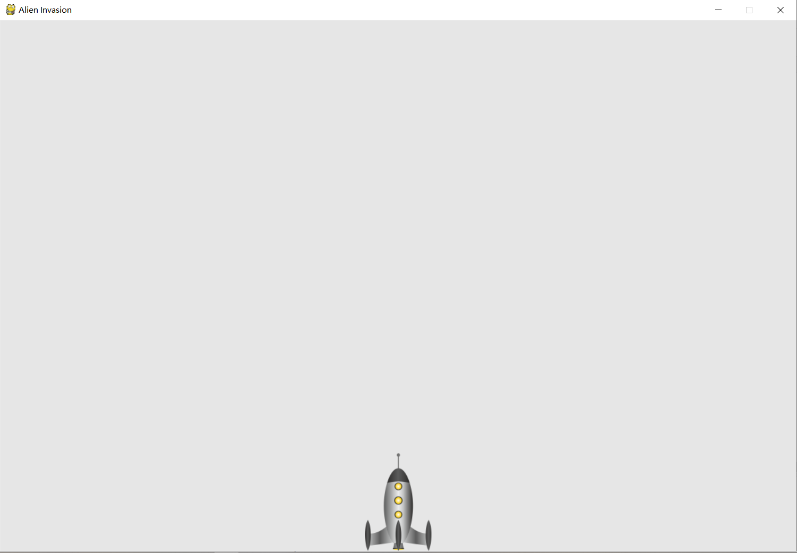
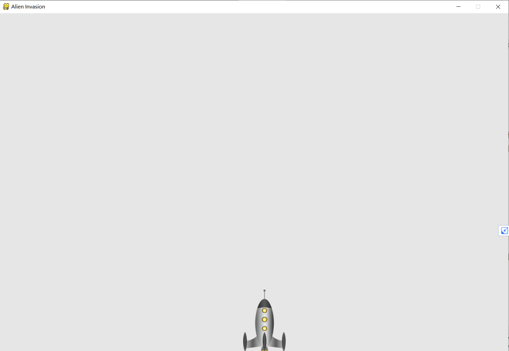

[TOC]

# 第12章 武装飞船


## 概览

​	开发一个程序

​	Pygame,这是一组功能强大而有趣的模块

​	管理图形,动画乃至声音

​	alien_invasion


## 12.1 规划项目

​	开发大型项目时,做好规划后再动手编写项目很重要。


## 12.2 安装Pygame

[Python pip pygame not support](../../everyday/202003/20200313_01.md)


## 12.3 开始游戏项目

​	创建一个空的Pygame窗口

### 12.3.1 创建Pygame窗口已经响应用户输入

​	alien_invasion.py

```
# coding=utf-8
import sys
import pygame

def run_game():
	# 初始化游戏并创建一个屏幕对象
	pygame.init()
	screen = pygame.display.set_mode((1200,800))
	pygame.display.set_caption("Alien Invasion")
	
	#开始游戏主循环
	while True:
		# 监视键盘和数票事件
		for event in pygame.event.get():
			if event.type == pygame.QUIT:
				sys.exit()
		
		# 让最近绘制的屏幕可见
		pygame.display.flip()
		
run_game()

```




### 12.3.2 设置背景色

​	alien_invasion.py

```
# coding=utf-8
import sys
import pygame

def run_game():
	# 初始化游戏并创建一个屏幕对象
	pygame.init()
	screen = pygame.display.set_mode((1200,800))
	pygame.display.set_caption("Alien Invasion")
	#设置背景色
	bg_color = (230,230,230)
	#开始游戏主循环
	while True:
		# 监视键盘和数票事件
		for event in pygame.event.get():
			if event.type == pygame.QUIT:
				sys.exit()
				
		# 每次循环时都重新绘制屏幕
		screen.fill(bg_color)
		
		# 让最近绘制的屏幕可见
		pygame.display.flip()
		
run_game()

```



### 12.3.3 创建设置类

​	settings.py

```
# coding=utf-8
class Settings():
	"""存储外星人入侵的所有设置的类"""
	
	def __init__(self):
		"""初始化游戏的设置"""
		# 屏幕设置
		self.screen_width =1200
		self.screen_height = 800
		self.bg_color = (230,230,230)

```

​	alien_invasion.py

```
# coding=utf-8
import sys
import pygame

from settings import Settings

def run_game():
	# 初始化游戏并创建一个屏幕对象
	pygame.init()
	ai_settings =Settings()
	screen = pygame.display.set_mode((ai_settings.screen_width,ai_settings.screen_height))
	pygame.display.set_caption("Alien Invasion")
	#设置背景色
	# bg_color = (230,230,230)
	#开始游戏主循环
	while True:
		# 监视键盘和数票事件
		for event in pygame.event.get():
			if event.type == pygame.QUIT:
				sys.exit()
				
		# 每次循环时都重新绘制屏幕
		screen.fill(ai_settings.bg_color)
		
		# 让最近绘制的屏幕可见
		pygame.display.flip()
		
run_game()

```


### 12.4 添加飞船图像


### 12.4.1 创建Ship类

​	ship.py

```
# coding=utf-8

import pygame
class Ship():
	
	def __init__(self,screen):
		"""初始化飞船并设置其初始位置"""
		self.screen = screen
		
		# 加载飞船图像并获取其外接矩形
		self.image=pygame.image.load('images/ship.png')
		self.rect = self.image.get_rect()
		self.screen_rect = screen.get_rect()
		
		# 将每艘新飞船放在屏幕底部中央
		self.rect.centerx = self.screen_rect.centerx
		self.rect.bottom = self.screen_rect.bottom
		
	def blitme(self):
		"""在指定位置绘制飞船"""
		self.screen.blit(self.image,self.rect)

```

​	alien_invasion.py

```
# coding=utf-8
import sys
import pygame

from settings import Settings
from ship import Ship


def run_game():
	# 初始化游戏并创建一个屏幕对象
	pygame.init()
	ai_settings =Settings()
	screen = pygame.display.set_mode((ai_settings.screen_width,ai_settings.screen_height))

	pygame.display.set_caption("Alien Invasion")
	
	#创建一艘飞船
	
	ship = Ship(screen)
	#设置背景色
	# bg_color = (230,230,230)
	#开始游戏主循环
	while True:
		# 监视键盘和数票事件
		for event in pygame.event.get():
			if event.type == pygame.QUIT:
				sys.exit()
				
		# 每次循环时都重新绘制屏幕
		screen.fill(ai_settings.bg_color)
		ship.blitme()
		# 让最近绘制的屏幕可见
		pygame.display.flip()
		
run_game()

```




## 12.5 重构:模块game_functions

​	在大型项目中，进场需要在添加新代码前重置既有代码


### 12.5.1 函数check_events()

​	首先将管理事件的代码移到一个名位check_events()的函数中,以简化run_game()并隔离事件管理循环。

​	game_functions.py

```
# coding=utf-8

import sys
import pygame

def check_events():
	"""响应按键和鼠标事件"""
	for event in pygame.event.get():
		if event.type == pygame.QUIT:
			sys.exit()


```

​	alien_invasion.py

```
# coding=utf-8
import sys
import pygame

from settings import Settings
from ship import Ship
import game_functions as gf


def run_game():
	# 初始化游戏并创建一个屏幕对象
	pygame.init()
	ai_settings =Settings()
	screen = pygame.display.set_mode((ai_settings.screen_width,ai_settings.screen_height))

	pygame.display.set_caption("Alien Invasion")
	
	#创建一艘飞船
	
	ship = Ship(screen)
	#设置背景色
	# bg_color = (230,230,230)
	#开始游戏主循环
	while True:
		# 监视键盘和数票事件
		gf.check_events()
		"""
		for event in pygame.event.get():
			if event.type == pygame.QUIT:
				sys.exit()
		"""		
		# 每次循环时都重新绘制屏幕
		screen.fill(ai_settings.bg_color)
		ship.blitme()
		# 让最近绘制的屏幕可见
		pygame.display.flip()
		
run_game()

```


### 12.5.2 函数 update_screen

​	进一步简化run_game(),下面将更新屏幕的代码移到update_screen()的函数中。

​	game_functions.py

```
# coding=utf-8

import sys
import pygame

def check_events():
	"""响应按键和鼠标事件"""
	for event in pygame.event.get():
		if event.type == pygame.QUIT:
			sys.exit()

def update_screen(ai_settings,screen,ship):
	# 每次循环时都重新绘制屏幕
	screen.fill(ai_settings.bg_color)
	ship.blitme()
	# 让最近绘制的屏幕可见
	pygame.display.flip()

```

​	alien_invasion.py

```
# coding=utf-8
import pygame

from settings import Settings
from ship import Ship
import game_functions as gf


def run_game():
	# 初始化游戏并创建一个屏幕对象
	pygame.init()
	ai_settings =Settings()
	screen = pygame.display.set_mode((ai_settings.screen_width,ai_settings.screen_height))

	pygame.display.set_caption("Alien Invasion")
	
	#创建一艘飞船
	
	ship = Ship(screen)
	#设置背景色
	# bg_color = (230,230,230)
	#开始游戏主循环
	while True:
		# 监视键盘和数票事件
		gf.check_events()
		"""
		for event in pygame.event.get():
			if event.type == pygame.QUIT:
				sys.exit()
		"""		
		gf.update_screen(ai_settings,screen,ship)
		"""
		# 每次循环时都重新绘制屏幕
		screen.fill(ai_settings.bg_color)
		ship.blitme()
		# 让最近绘制的屏幕可见
		pygame.display.flip()
		"""
run_game()

```


## 12.6 驾驶飞船

​	左右移动飞船


### 12.6.1 响应按键

​	每当用户按键时，都在Pygame中注册一个事件。

​	game_functions.py

```
# coding=utf-8

import sys
import pygame
from ship import Ship 

def check_events(ship):
	"""响应按键和鼠标事件"""
	for event in pygame.event.get():
		if event.type == pygame.QUIT:
			sys.exit()
		elif event.type == pygame.KEYDOWN:
			if event.key == pygame.K_RIGHT:
				# 向右移动飞船
				ship.rect.centerx +=1

def update_screen(ai_settings,screen,ship):
	# 每次循环时都重新绘制屏幕
	screen.fill(ai_settings.bg_color)
	ship.blitme()
	# 让最近绘制的屏幕可见
	pygame.display.flip()

```

​	alien_invasion.py

```
# coding=utf-8
import pygame

from settings import Settings
from ship import Ship
import game_functions as gf


def run_game():
	# 初始化游戏并创建一个屏幕对象
	pygame.init()
	ai_settings =Settings()
	screen = pygame.display.set_mode((ai_settings.screen_width,ai_settings.screen_height))

	pygame.display.set_caption("Alien Invasion")
	
	#创建一艘飞船
	
	ship = Ship(screen)
	#设置背景色
	# bg_color = (230,230,230)
	#开始游戏主循环
	while True:
		# 监视键盘和数票事件
		gf.check_events(ship)
		"""
		for event in pygame.event.get():
			if event.type == pygame.QUIT:
				sys.exit()
		"""		
		gf.update_screen(ai_settings,screen,ship)
		"""
		# 每次循环时都重新绘制屏幕
		screen.fill(ai_settings.bg_color)
		ship.blitme()
		# 让最近绘制的屏幕可见
		pygame.display.flip()
		"""
run_game()

```

​	移动右键确实移动了一点点




### 12.6.2 允许不断移动

​	ship.py

```
# coding=utf-8

import pygame
class Ship():
	
	def __init__(self,screen):
		"""初始化飞船并设置其初始位置"""
		self.screen = screen
		
		# 加载飞船图像并获取其外接矩形
		self.image=pygame.image.load('images/ship.png')
		self.rect = self.image.get_rect()
		self.screen_rect = screen.get_rect()
		
		# 将每艘新飞船放在屏幕底部中央
		self.rect.centerx = self.screen_rect.centerx
		self.rect.bottom = self.screen_rect.bottom
		
		# 移动标志
		self.moving_right = False
		
	def update(self):
		# 根据移动标志调整飞船的位置
		if self.moving_right:
			self.rect.centerx +=1
		
	def blitme(self):
		"""在指定位置绘制飞船"""
		self.screen.blit(self.image,self.rect)

```

​	game_functions.py

```python
# coding=utf-8

import sys
import pygame
from ship import Ship 

def check_events(ship):
	"""响应按键和鼠标事件"""
	for event in pygame.event.get():
		if event.type == pygame.QUIT:
			sys.exit()
		elif event.type == pygame.KEYDOWN:
			if event.key == pygame.K_RIGHT:
				"""# 向右移动飞船
				ship.rect.centerx +=1"""
				ship.moving_right = True
		elif event.type == pygame.KEYUP:
			if event.key == pygame.K_RIGHT:
				ship.moving_right = False

def update_screen(ai_settings,screen,ship):
	# 每次循环时都重新绘制屏幕
	screen.fill(ai_settings.bg_color)
	ship.blitme()
	# 让最近绘制的屏幕可见
	pygame.display.flip()

```

​	alien_invasion.py

```python
# coding=utf-8
import pygame

from settings import Settings
from ship import Ship
import game_functions as gf


def run_game():
	# 初始化游戏并创建一个屏幕对象
	pygame.init()
	ai_settings =Settings()
	screen = pygame.display.set_mode((ai_settings.screen_width,ai_settings.screen_height))

	pygame.display.set_caption("Alien Invasion")
	
	#创建一艘飞船
	
	ship = Ship(screen)
	#设置背景色
	# bg_color = (230,230,230)
	#开始游戏主循环
	while True:
		# 监视键盘和数票事件
		gf.check_events(ship)
		ship.update()
		gf.update_screen(ai_settings,screen,ship)

run_game()

```

​	移动到没有回来


### 12.6.3 左右移动

​	ship.py

```python
# coding=utf-8

import pygame
class Ship():
	
	def __init__(self,screen):
		"""初始化飞船并设置其初始位置"""
		self.screen = screen
		
		# 加载飞船图像并获取其外接矩形
		self.image=pygame.image.load('images/ship.png')
		self.rect = self.image.get_rect()
		self.screen_rect = screen.get_rect()
		
		# 将每艘新飞船放在屏幕底部中央
		self.rect.centerx = self.screen_rect.centerx
		self.rect.bottom = self.screen_rect.bottom
		
		# 移动标志
		self.moving_right = False
		self.moving_left = False
		
	def update(self):
		# 根据移动标志调整飞船的位置
		if self.moving_right:
			self.rect.centerx +=1
		if self.moving_left:
			self.rect.centerx -=1
		
	def blitme(self):
		"""在指定位置绘制飞船"""
		self.screen.blit(self.image,self.rect)

```


​	game_functions.py

```python
# coding=utf-8

import sys
import pygame
from ship import Ship 

def check_events(ship):
	"""响应按键和鼠标事件"""
	for event in pygame.event.get():
		if event.type == pygame.QUIT:
			sys.exit()
		elif event.type == pygame.KEYDOWN:
			if event.key == pygame.K_RIGHT:
				"""# 向右移动飞船
				ship.rect.centerx +=1"""
				ship.moving_right = True
			elif event.key == pygame.K_LEFT:
				ship.moving_left = True
		elif event.type == pygame.KEYUP:
			if event.key == pygame.K_RIGHT:
				ship.moving_right = False
			elif event.key == pygame.K_LEFT:
				ship.moving_right = False

def update_screen(ai_settings,screen,ship):
	# 每次循环时都重新绘制屏幕
	screen.fill(ai_settings.bg_color)
	ship.blitme()
	# 让最近绘制的屏幕可见
	pygame.display.flip()

```

​	alien_invasion.py

```python
# coding=utf-8
import pygame

from settings import Settings
from ship import Ship
import game_functions as gf


def run_game():
	# 初始化游戏并创建一个屏幕对象
	pygame.init()
	ai_settings =Settings()
	screen = pygame.display.set_mode((ai_settings.screen_width,ai_settings.screen_height))

	pygame.display.set_caption("Alien Invasion")
	
	#创建一艘飞船
	
	ship = Ship(screen)
	#设置背景色
	# bg_color = (230,230,230)
	#开始游戏主循环
	while True:
		# 监视键盘和数票事件
		gf.check_events(ship)
		ship.update()
		gf.update_screen(ai_settings,screen,ship)

run_game()

```


### 12.6.4 调整飞船的速度

​	settings.py

```
# coding=utf-8
class Settings():
	"""存储外星人入侵的所有设置的类"""
	
	def __init__(self):
		"""初始化游戏的设置"""
		# 屏幕设置
		self.screen_width =1200
		self.screen_height = 800
		self.bg_color = (230,230,230)
		self.ship_speed_factor = 1.5

```


​	ship.py

```
# coding=utf-8

import pygame
class Ship():
	
	def __init__(self,ai_settings,screen):
		"""初始化飞船并设置其初始位置"""
		self.screen = screen
		self.ai_settings = ai_settings
		
		# 加载飞船图像并获取其外接矩形
		self.image=pygame.image.load('images/ship.png')
		self.rect = self.image.get_rect()
		self.screen_rect = screen.get_rect()
		
		# 将每艘新飞船放在屏幕底部中央
		self.rect.centerx = self.screen_rect.centerx
		self.rect.bottom = self.screen_rect.bottom
		
		# 在飞船的属性center中存储小数值
		self.center = float(self.rect.centerx)
		
		
		# 移动标志
		self.moving_right = False
		self.moving_left = False
		
	def update(self):
		# 根据移动标志调整飞船的位置
		if self.moving_right:
			self.center +=self.ai_settings.ship_speed_factor
		if self.moving_left:
			self.center -=self.ai_settings.ship_speed_factor
		
		
		"""
		if self.moving_right:
			self.rect.centerx +=1
		if self.moving_left:
			self.rect.centerx -=1
		"""
		# 根据self.center更新rect对象
		self.rect.centerx = self.center
		
	def blitme(self):
		"""在指定位置绘制飞船"""
		self.screen.blit(self.image,self.rect)

```

​	alien_invasion.py

```
# coding=utf-8
import pygame

from settings import Settings
from ship import Ship
import game_functions as gf


def run_game():
	# 初始化游戏并创建一个屏幕对象
	pygame.init()
	ai_settings =Settings()
	screen = pygame.display.set_mode((ai_settings.screen_width,ai_settings.screen_height))

	pygame.display.set_caption("Alien Invasion")
	
	#创建一艘飞船
	
	ship = Ship(ai_settings,screen)
	#设置背景色
	# bg_color = (230,230,230)
	#开始游戏主循环
	while True:
		# 监视键盘和数票事件
		gf.check_events(ship)
		ship.update()
		gf.update_screen(ai_settings,screen,ship)

run_game()

```


### 12.6.5 限制飞船的活动范围

​	ship.py

```
# coding=utf-8

import pygame
class Ship():
	
	def __init__(self,ai_settings,screen):
		"""初始化飞船并设置其初始位置"""
		self.screen = screen
		self.ai_settings = ai_settings
		
		# 加载飞船图像并获取其外接矩形
		self.image=pygame.image.load('images/ship.png')
		self.rect = self.image.get_rect()
		self.screen_rect = screen.get_rect()
		
		# 将每艘新飞船放在屏幕底部中央
		self.rect.centerx = self.screen_rect.centerx
		self.rect.bottom = self.screen_rect.bottom
		
		# 在飞船的属性center中存储小数值
		self.center = float(self.rect.centerx)
		
		
		# 移动标志
		self.moving_right = False
		self.moving_left = False
		
	def update(self):
		# 根据移动标志调整飞船的位置
		if self.moving_right and self.rect.right < self.screen_rect.right:
			self.center +=self.ai_settings.ship_speed_factor
		if self.moving_left and self.rect.left >0:
			self.center -=self.ai_settings.ship_speed_factor
		
		
		"""
		if self.moving_right:
			self.rect.centerx +=1
		if self.moving_left:
			self.rect.centerx -=1
		"""
		# 根据self.center更新rect对象
		self.rect.centerx = self.center
		
	def blitme(self):
		"""在指定位置绘制飞船"""
		self.screen.blit(self.image,self.rect)

```


### 12.6.7 重构check_events()

