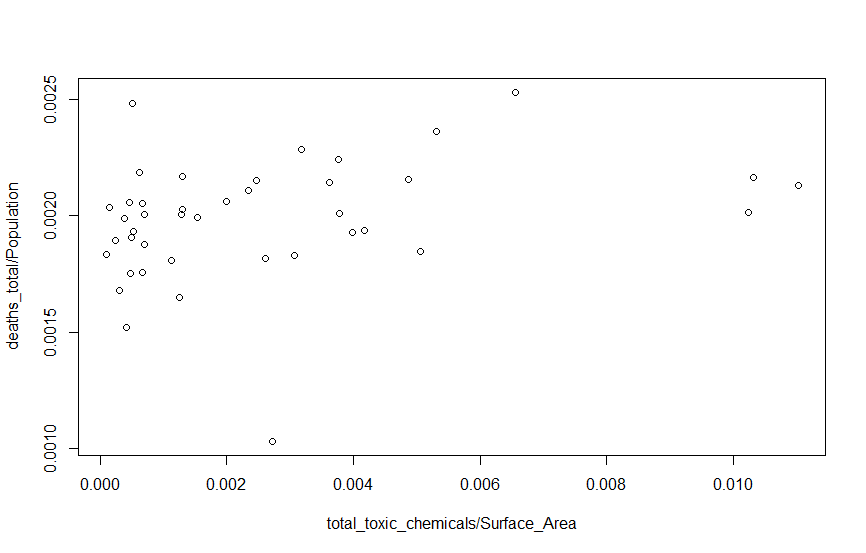
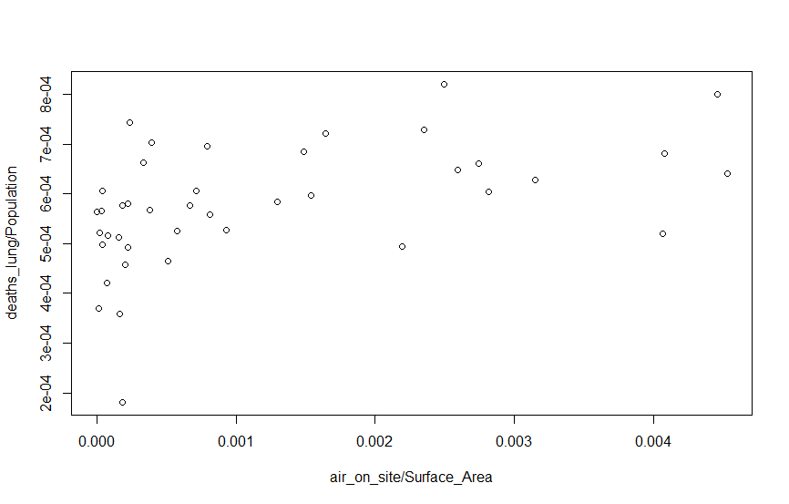
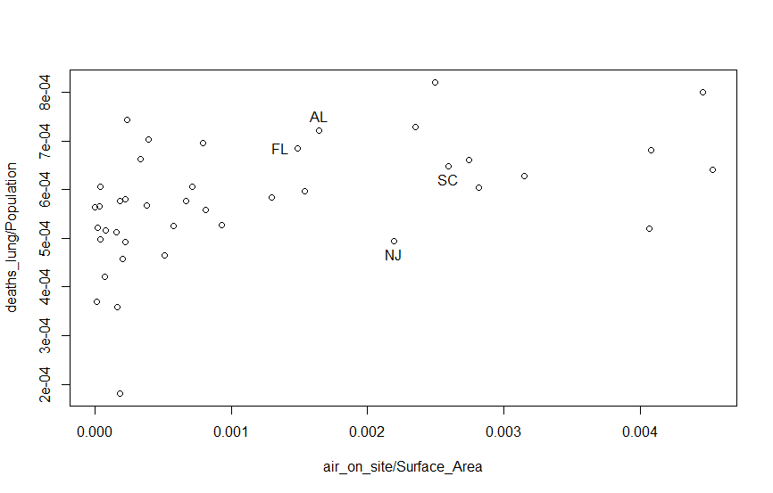
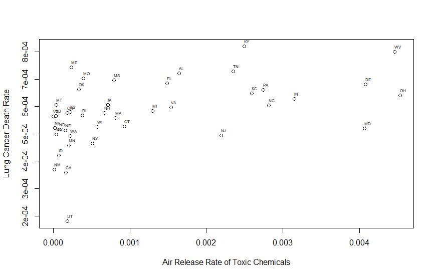
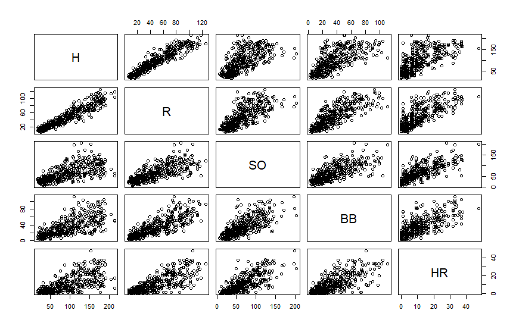
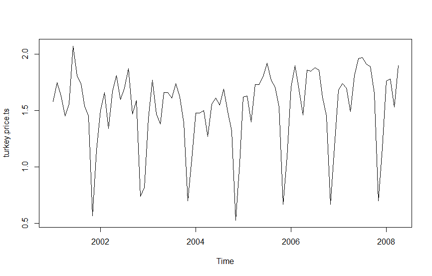
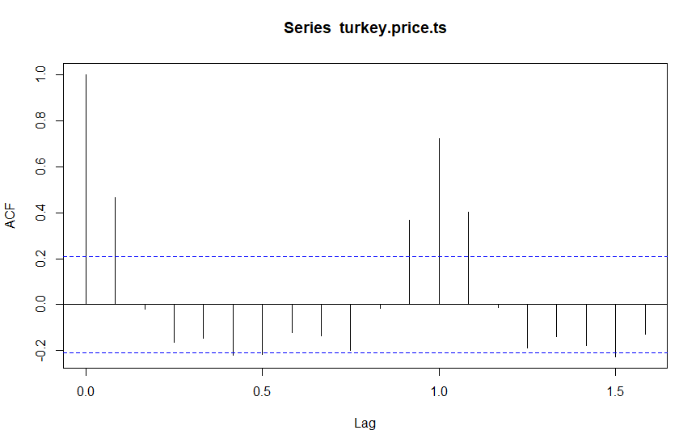
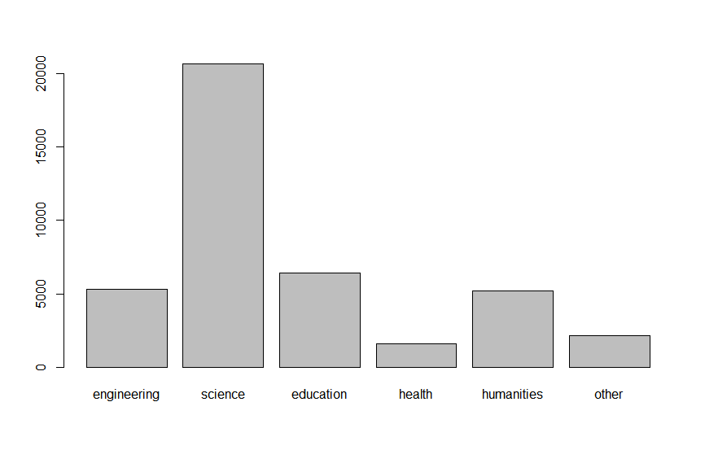
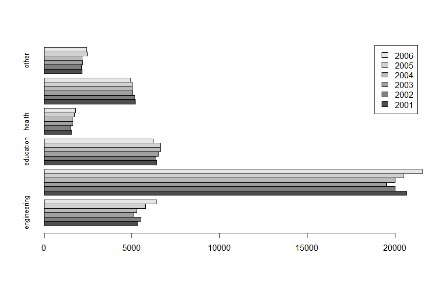

[TOC]

# 第13章 图形


## 概览

​	在R中有很多画图的方法，本书中主要讲述三个使用最广泛的包graphics，lattice和ggplot2。

## R Graphics 概述

​	R中提供了绘制常见图形的工具，包括了柱状图，饼图，线图和散点图等

| Graphics包函数   | 描述               |
| ---------------- | ------------------ |
| barplot          | 柱状图或列图       |
| dotchart         | 克里夫兰点图       |
| hist             | 直方图             |
| density          | 核密度图           |
| stripchart       | 纸带图             |
| qqnorm           | Q-Q图              |
| xplot            | 散点图             |
| smoothScatter    | 平滑散点图         |
| qqplot           | Q-Q图              |
| paris            | 散点矩阵图         |
| image            | image图            |
| coutour          | 等高图             |
| persp            | 三维数据透视图     |
| interaction.plot | 双因子组融响应总结 |
| sunfowerplot     | 太阳花图           |


## 散点图

​	

**plot函数**

​	演示散点图，2008年的癌症病例和2006年大气有毒物质数据。

```R
> library(nutshell)
> data("toxins.and.cancer")
```

​	使用plot函数可以画出散点图。plot是一个泛型函数(可以画出不同类型的对象)

​	plot可以画出很多类型的对象，包括向量，表格和时间序列

​	最简单的散点图是两个变量,调用的函数是plot.default

```
## Default S3 method:
plot(x, y = NULL, type = "p",  xlim = NULL, ylim = NULL,
     log = "", main = NULL, sub = NULL, xlab = NULL, ylab = NULL,
     ann = par("ann"), axes = TRUE, frame.plot = axes,
     panel.first = NULL, panel.last = NULL, asp = NA,
     xgap.axis = NA, ygap.axis = NA,
     ...)
```

​	下面介绍plot函数的参数

| 参数        | 描述                         | 默认值 |
| ----------- | ---------------------------- | ------ |
| x,y         | 绘制的数据。                 |        |
| type        | 设置绘制类型的字符           |        |
| xlim        | 数值向量                     |        |
| log         | 字符，设置坐标轴是否要取对数 |        |
| main        | 图形的主标题                 |        |
| sub         | 图形的副标题                 |        |
| xlab        | x轴的标签                    |        |
| ylab        | y轴的标签                    |        |
| ann         |                              |        |
| axes        |                              |        |
| frame.plot  |                              |        |
| panel.first |                              |        |
| panel.last  |                              |        |
| asp         |                              |        |
| ...         |                              |        |

​	画出第一个图。比较整体的癌病发病率和大气中有毒物质的含量

```
> # 不用敲键盘输入这个数据框的名字
> attach(toxins.and.cancer)
> plot(total_toxic_chemicals/Surface_Area,deaths_total/Population)
```

​	画出的图(大气有毒物质含量和新发癌症病率)



​	第二个图：大气中有毒物质含量和肺癌情况

```
> plot(air_on_site/Surface_Area,deaths_lung/Population)
```

​	画出的图(大气中有毒物质排放量和肺癌死亡人数)



​	这样感觉大气中的有毒物质含量与肺癌有很强的相关性。


​	如果你想知道每个点代表哪个州，R里面提供了识别图中点的交互工具。可以用locator函数得到每个点(或一组点)的坐标。

​	首先将数据画出来，再输入locator(1),然后单击打开的图形窗口中的某个值。

​	在画出上面的数据，输入locator(1)，然后单击图形中的右上角，可以在R控制台看出如下的输出

```
> locator(1)
$x
[1] 1.711344e-05

$y
[1] 0.0003705831
```

​	另一个用于识别点的函数identify.这个函数可以交互的给图中的点加上标签

```
> identify(air_on_site/Surface_Area,deaths_lung/Population,State_Abbrev)
警告: 已经找到了最近的点
警告: 已经找到了最近的点
警告: 已经找到了最近的点
[1]  1  5 22 32
```

画出的图



​	单击图中的每个点，R都会为这些点上标上州的名称。

​	

​	如果想要一次性给所有的点加上标签，可以使用text函数。

```
> plot(air_on_site/Surface_Area,deaths_lung/Population,xlab="Air Release Rate of Toxic Chemicals",ylab="Lung Cancer Death Rate")
> text(air_on_site/Surface_Area,deaths_lung/Population,labels=State_Abbrev,cex=0.5,adj=c(0,-1))
```

​	画出的图((空气中有毒物质含量与肺癌死亡人数))



​		xlab和ylab参数用于给x轴和y轴加上标签

​		text函数会给每个点旁边加上标签

​		cex和adj参数优化了标签的大小和摆放位置


 **matplot**

​	如果只是吧两列数据画出来，plot是个不错的选择，但如果有很多列数据要画，而且这些列可能被分成很多类别;或者,要对比画出两矩阵所有列的图。

​	如果要画出这样的图，可以用matplot函数

```
matplot(x, y, type = "p", lty = 1:5, lwd = 1, lend = par("lend"),
        pch = NULL,
        col = 1:6, cex = NULL, bg = NA,
        xlab = NULL, ylab = NULL, xlim = NULL, ylim = NULL,
        log = "", ..., add = FALSE, verbose = getOption("verbose"))
```

```
Arguments
x,y	
vectors or matrices of data for plotting. The number of rows should match. If one of them are missing, the other is taken as y and an x vector of 1:n is used. Missing values (NAs) are allowed.

type	
character string (length 1 vector) or vector of 1-character strings indicating the type of plot for each column of y, see plot for all possible types. The first character of type defines the first plot, the second character the second, etc. Characters in type are cycled through; e.g., "pl" alternately plots points and lines.

lty,lwd,lend	
vector of line types, widths, and end styles. The first element is for the first column, the second element for the second column, etc., even if lines are not plotted for all columns. Line types will be used cyclically until all plots are drawn.

pch	
character string or vector of 1-characters or integers for plotting characters, see points. The first character is the plotting-character for the first plot, the second for the second, etc. The default is the digits (1 through 9, 0) then the lowercase and uppercase letters.

col	
vector of colors. Colors are used cyclically.

cex	
vector of character expansion sizes, used cyclically. This works as a multiple of par("cex"). NULL is equivalent to 1.0.

bg	
vector of background (fill) colors for the open plot symbols given by pch = 21:25 as in points. The default NA corresponds to the one of the underlying function plot.xy.

xlab, ylab	
titles for x and y axes, as in plot.

xlim, ylim	
ranges of x and y axes, as in plot.

log, ...	
Graphical parameters (see par) and any further arguments of plot, typically plot.default, may also be supplied as arguments to this function; even panel.first etc now work. Hence, the high-level graphics control arguments described under par and the arguments to title may be supplied to this function.

add	
logical. If TRUE, plots are added to current one, using points and lines.

verbose	
logical. If TRUE, write one line of what is done.
```

​	matplot的很多参数的名称都和par的标准图形参数是一样的。

**smoothScatter**

​	如果要画出大量的点，可能smoothScatter函数更有用，这个函数用不同的阴影来表示图的不同区域中的密度。

```
smoothScatter(x, y = NULL, nbin = 128, bandwidth,
              colramp = colorRampPalette(c("white", blues9)),
              nrpoints = 100, ret.selection = FALSE,
              pch = ".", cex = 1, col = "black",
              transformation = function(x) x^.25,
              postPlotHook = box,
              xlab = NULL, ylab = NULL, xlim, ylim,
              xaxs = par("xaxs"), yaxs = par("yaxs"), ...)
```


**pairs**

​	数据框中有n个变量,如果要逐对的画出这些变量之间的散点图，可以试试pairs函数

```
> library(nutshell)
> data("batting.2008")
> pairs(batting.2008[batting.2008$AB>100,c("H","R","SO","BB","HR")])
```

​	画出的图(pairs示例)



## 时间序列

**plot**

​	plot函数可以画出时间序列

```R
plot(x, y = NULL, plot.type=c("multiple","single"),xy.labels,xy.lines,panel=lines,nc,yax.flip=FALSE,mar.multi=c(0,5.1,0,if(yax.flip) 5.1 else 2.1), oma.multi =c(6,0,5,0),axes=TRUE,
     ...)
```

​	参数x,y设置ts对象，panel设置如何画时间序列,其他参数用于设置如何将时间序列分割成不同的图。

```
> library(nutshell)
> data("turkey.price.ts")
> plot(turkey.price.ts)
```


​	画出的图(时间序列图)




**acf**

​	看季节性效应的方法是自相关图(actocorrelation plot)

​	这种图会展现不同时间点的数据点之间的关系。

```
> acf(turkey.price.ts)
```

​	画出的图(自相关函数图)



## 柱状图

```
> library(nutshell)
> data("doctorates")
> doctorates
  year engineering science education health humanities other
1 2001        5323   20643      6436   1591       5213  2159
2 2002        5511   20017      6349   1541       5178  2141
3 2003        5079   19529      6503   1654       5051  2209
4 2004        5280   20001      6643   1633       5020  2180
5 2005        5777   20498      6635   1720       5013  2480
6 2006        6425   21564      6226   1785       4949  2436
```

​	将其转换为矩阵

```
> doctorates.m <- as.matrix(doctorates[2:7])
> rownames(doctorates.m) <- doctorates[,1]
> doctorates.m
     engineering science education health humanities other
2001        5323   20643      6436   1591       5213  2159
2002        5511   20017      6349   1541       5178  2141
2003        5079   19529      6503   1654       5051  2209
2004        5280   20001      6643   1633       5020  2180
2005        5777   20498      6635   1720       5013  2480
2006        6425   21564      6226   1785       4949  2436
```

​	barplot函数无法处理数据框，所以需要为这份数据创建一个矩阵来解决这个问题

```
> barplot(doctorates.m[1,])
```

​	画出下图简单的柱状图例子



​	把不同年份的数据用相邻的柱子显示,柱状图的柱子是水平的

```
> barplot(doctorates.m,beside=TRUE,horiz =TRUE,legend=TRUE,cex.names=.79)
```

​	图示 横向并列的柱状图例子




## 全量脚本

```
library(nutshell)
data("toxins.and.cancer")
attach(toxins.and.cancer)
help(plot)
?plot

plot(total_toxic_chemicals/Surface_Area,deaths_total/Population)
plot(air_on_site/Surface_Area,deaths_lung/Population)
locator(1)
identify(air_on_site/Surface_Area,deaths_lung/Population,State_Abbrev)


plot(air_on_site/Surface_Area,deaths_lung/Population,xlab="Air Release Rate of Toxic Chemicals",ylab="Lung Cancer Death Rate")
text(air_on_site/Surface_Area,deaths_lung/Population,labels=State_Abbrev,cex=0.5,adj=c(0,-1))

help(matplot)
help("smoothScatter")

library(nutshell)
data("batting.2008")
pairs(batting.2008[batting.2008$AB>100,c("H","R","SO","BB","HR")])

help(plot)


library(nutshell)
data("turkey.price.ts")
turkey.price.ts
plot(turkey.price.ts)


acf(turkey.price.ts)

```

