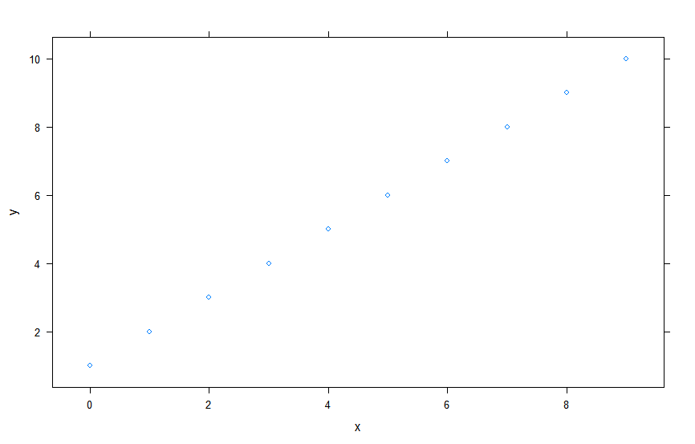

[TOC]

# 第14章 Lattice 绘图


## 概览

​	lattice包提供了一种在R中绘图的方式。在R中标准绘图不同,lattice包有不同的函数，有不同的选项。

​	lattice包真正强大的地方在于将一个图形分成不同的栅栏将一个图划分成多组图。


## 历史

​	Richard Becker和WilliamCleveland建立了一个用于展示数据的革命性的新系统，称为网格作图。


## lattice包概览

​	lattice图由一个或者多个称为面板的长方形绘图区域构成。赋值给每一个面板的数据可以看作一个数据包。lattice的函数通过调用一个或者多个面板函数来工作，数据包绘制在相关的面板内。通过绘图函数参数或者改变面板函数来改变图形的外观。


## lattice的工作原理

​	lattice中常见的操作如下：

​	1、终端用户调用一个高级绘图函数

​	2、lattice函数检查调用的参数和默认的参数，组装一个lattice对象，最后返回这个函数。

​	3、用户用lattice对象作为参数来调用print.lattice或者plot.alttice(通常在R控制台自动实现)

​	4、函数plot.lattice搭建了面板矩阵，对不同的面板打不通的包，之后调用面板函数来指定lattice对象来创建个人面板


## 例子


```R
> d <- data.frame(x=c(0:9),y=c(1:10),z=c(rep(c("a","b"),times=5)))

> library(lattice)
> xyplot(y~x,data=d)
> dev.off()
```





